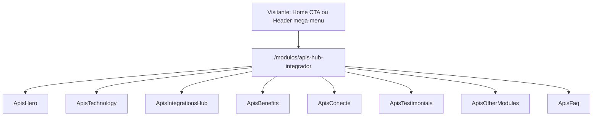

# APIs & HUB Integrador (`/modulos/apis-hub-integrador`) Design

**Spec**: `.specs/features/apis-hub-integrador/spec.md`
**Status**: Draft

---

## Architecture Approaches Considered

| # | Approach | Trade-off | Verdict |
| - | -------- | --------- | ------- |
| 1 | **Dedicated static page** — `app/pages/modulos/apis-hub-integrador.vue` compõe 8 seções (`Apis*.vue`), reaproveitando `layout/` shells por wrapper fino onde a estrutura já bate (Hero, Technology, Testimonials, Faq) e componentes bespoke onde não há shell genérico (Benefits, Content/Integrações, Other Modules) ou onde reuso forçado quebraria a regra "real responsibility, real reuse" do CLAUDE.md | Nenhum de nota — é o padrão já validado em `/modulos/crm` e nas demais páginas `/modulos/*` | **Recomendado** |
| 2 | Reaproveitar `CrmIntegrations.vue` diretamente para a seção 5 (Content/Integrações), já que o texto é idêntico | `CrmIntegrations.vue` tem zero props (script setup vazio) e a imagem hardcoded é diferente (grade de 6 bolhas vs. `conecte.png`); reaproveitar exigiria refatorar um componente já publicado em produção (`/modulos/crm`) para aceitar um slot de imagem — risco de regressão numa página que não faz parte desta feature | Rejeitado nesta feature; documentado como oportunidade futura (ver Riscos) |
| 3 | Forçar todas as 8 seções através de `layout/Portfolio.vue` (dado que a seção 3 bate na estrutura) | Portfolio.vue não tem overflow-clip/dimensões fixas como `CrmIntegrations.vue`; forçar a seção 5 nele descartaria a decisão já registrada no spec de que o lado visual da seção 5 é uma imagem única sem dado repetido — abstração sem segunda chamada real | Rejeitado para a seção 5; mantido como candidato de reuso só para a seção 3 |

**Decisão**: Approach 1. Reflete as decisões já confirmadas no `spec.md` (Assumptions & Open Questions).



---

## Code Reuse Analysis

### Existing Components to Leverage

| Component | Location | How to Use |
| --- | --- | --- |
| `layout/Hero.vue` | `app/components/layout/Hero.vue` | Base do `ApisHero.vue` — badge/H1/descrição/ícones de módulo + slot `#visual` com a composição foto+cards pré-composta (`card_arrow.png`), mesmo padrão de `CrmHero.vue` ([[AD-012]]) |
| `layout/Technology.vue` | `app/components/layout/Technology.vue` | Base do `ApisTechnology.vue` — heading/descrição/CTA + mockup (`technology-mockup-telas.png`) |
| `layout/Portfolio.vue` | `app/components/layout/Portfolio.vue` | Candidato de base para `ApisIntegrationsHub.vue` (seção 3) — tentar wrapper primeiro; a estrutura (heading/lead + `#image` + `#summary` com features[] + CTA) bate com a seção 3 |
| `layout/Testimonials.vue` | `app/components/layout/Testimonials.vue` | Base do `ApisTestimonials.vue`, mesmo padrão de `CrmTemporadaTestimonials.vue` (filtra `app/data/testimonials.json` por array de `id`, passa só `:testimonials` + `section-id`) |
| `layout/Faq.vue` | `app/components/layout/Faq.vue` | Base do `ApisFaq.vue`, wrapper fino idêntico a `CrmFaq.vue` ([[AD-008]]: ícones "+"/"−" reais via `plus-icon-src`/`minus-icon-src`) |
| `CtaButton.vue` | `app/components/ui/CtaButton.vue` | Todos os CTAs "Testar grátis por 30 dias" (variant `primary`) |
| `SectionTag.vue` | `app/components/ui/SectionTag.vue` | Tag "INTEGRAÇÕES" da seção 5 |
| `app/data/testimonials.json` | — | Reaproveitado sem alteração — filtra pelos ids `crm-temporada-joao-calcada` e `crm-geral-cleveson-costa` |

### Integration Points

| System | Integration Method |
| --- | --- |
| `HeroIntegrations.vue` (Home) | Já linka para `/modulos/apis-hub-integrador` via `CtaButton` — confirmado, sem alteração necessária. |
| `HeaderBar.vue` mega-menu | Já linka para `/modulos/apis-hub-integrador` (coluna "INTEGRAÇÕES E HABILIDADES") — confirmado, sem alteração necessária. |
| Figma → content pipeline | `get_design_context`/`get_metadata` node a node → `FIGMA_CONTENT_MANIFEST_APIS_HUB.md` (já escrito) → assets salvos em `public/images/modulos-apis-hub-integrador/` (5 já exportados) e `public/icons/` (pendentes, ver spec) → componentes escritos a partir do manifesto. |

---

## Components

Todas as 8 seções são Vue 3 `<script setup>` SFCs. As que envolvem `layout/` usam `withDefaults()` só para as poucas props/slots necessários (nenhuma reexpõe a superfície inteira do shell, seguindo o padrão de `CrmHero.vue`/`CrmTechnology.vue`); as bespoke seguem o padrão hardcoded-sem-props de `CrmAllInOne.vue`/`CrmIntegrations.vue`/`CrmOtherModules.vue`.

### `app/pages/modulos/apis-hub-integrador.vue`
- **Purpose**: Route entry point; compõe as 8 seções na ordem do Figma, `useSeoMeta`.
- **Reuses**: padrão de `app/pages/modulos/crm.vue`.

### `ApisHero.vue` — node `3164:35380`
- **Purpose**: Hero/top — H1, descrição, ícones de módulo, composição visual foto+cards.
- **Dependencies**: `layout/Hero.vue`, `hero-foto-mulher-tablet.png`, `card_arrow.png`.
- **Sem CTA** (confirmado no manifesto).

### `ApisTechnology.vue` — node `3164:38941`
- **Purpose**: Heading/descrição/CTA + mockup estático.
- **Dependencies**: `layout/Technology.vue`, `technology-mockup-telas.png`, `CtaButton`.

### `ApisIntegrationsHub.vue` — node `3165:39276`
- **Purpose**: Bloco imagem+features do Hub de integrações (4 itens).
- **Dependencies**: `layout/Portfolio.vue` (tentar primeiro) ou markup bespoke, `portfolio-telas-apis-hub.png`, `CtaButton`.
- **Decisão adiada**: confirmar em implementação se `Portfolio.vue` comporta as dimensões 1920×1060/duas colunas sem forçar overflow.

### `ApisBenefits.vue` — node `3164:35970`
- **Purpose**: Grid de 3 cards de benefício (ícone + H3 + descrição).
- **Dependencies**: nenhum shell genérico — bespoke, padrão `CrmAllInOne.vue`.

### `ApisConecte.vue` — node `3164:36002`
- **Purpose**: Bloco duas-colunas (tag+H2+descrição+CTA / imagem `conecte.png`).
- **Dependencies**: `SectionTag`, `CtaButton`. Bespoke — texto idêntico a `CrmIntegrations.vue`, mas escrito como novo componente local (não reexporta `CrmIntegrations.vue`) porque este não tem props para trocar a imagem.
- **Nota**: se uma terceira página futura repetir este mesmo texto+CTA com uma quarta imagem diferente, aí sim vale promover o padrão para `layout/` (regra "real responsibility, real reuse" — 2 ocorrências ainda não justificam a abstração agora, mas já são 2, o que é o limiar mínimo a observar).

### `ApisTestimonials.vue` — node `3168:39878`
- **Purpose**: 2 depoimentos reaproveitados de `testimonials.json`.
- **Dependencies**: `layout/Testimonials.vue`.

### `ApisOtherModules.vue` — node `3164:36110`
- **Purpose**: Header + banner único "Base de conhecimento" (não é grid de cards).
- **Dependencies**: nenhum shell — bespoke, literal único (não uma lista de N=1).
- **Nota**: `href` do banner é placeholder até confirmação (ver spec Open Questions).

### `ApisFaq.vue` — node `3168:40054`
- **Purpose**: Accordion de 6 perguntas/respostas.
- **Dependencies**: `layout/Faq.vue`, `/icons/faq-plus-circle.svg`/`faq-minus-circle.svg`.
- **Reuses**: `CrmFaq.vue:1-112` como referência de wrapper (mesmo shape de props).

---

## Data Models (local content shapes, not persisted)

```typescript
// ApisHero.vue
interface ModuleIcon { src: string; alt: string }

// ApisIntegrationsHub.vue — PortfolioFeature (reaproveitar o tipo de layout/Portfolio.vue se já existir com este shape)
interface HubFeatureItem { icon: string; title: string; description: string }

// ApisBenefits.vue
interface BenefitCard { icon: string; title: string; description: string }

// ApisOtherModules.vue — literal único, não array
interface KnowledgeBaseBanner {
  icon: string
  title: string        // "Base de conhecimento"
  description: string  // "Tutoriais, guias e documentação completa para usar a plataforma."
  linkLabel: string     // "Clique aqui"
  linkHref: string      // placeholder até confirmação
}

// ApisFaq.vue — mirrors CrmFaq.vue's `faqs` shape
interface FaqItem { question: string; answer: string }
```

**Relationships**: nenhuma — cada array é local ao seu componente. `ApisTestimonials.vue` é a única exceção, lendo de `app/data/testimonials.json` (compartilhado, não modificado).

---

## Error Handling Strategy

| Error Scenario | Handling | User Impact |
| --- | --- | --- |
| Link "Base de conhecimento" sem destino confirmado | `href="#"` documentado no código até confirmação | Link não navega para lugar nenhum até ser corrigido numa iteração futura — comportamento intencional e documentado, não um bug silencioso |
| Imagem/ícone não carrega | `alt` text padrão, sem retry/placeholder — mesmo padrão do resto do site | Ícone quebrado no navegador; coberto pela auditoria de QA final |

---

## Risks & Concerns

| Concern | Location | Impact | Mitigation |
| --- | --- | --- | --- |
| Texto da seção 5 duplicado entre `CrmIntegrations.vue` e `ApisConecte.vue` (2 componentes, mesmo texto, imagens diferentes) | `app/components/sections/CrmIntegrations.vue`, `ApisConecte.vue` (novo) | Se o texto mudar num produto, alguém pode esquecer de atualizar o outro | Documentado nesta design.md; não promovido a `layout/` agora por ter apenas 2 ocorrências e nenhuma delas com prop de imagem hoje — reavaliar se uma 3ª página repetir o padrão |
| `href` do CTA "Testar grátis por 30 dias" assumido como `/testar-gratis` sem confirmação explícita | 3 seções (`ApisTechnology`, `ApisIntegrationsHub`, `ApisConecte`) | Se a rota real for outra, precisa de correção pós-implementação | Confirmar a rota existente (`grep` por `/testar-gratis` no código) antes de escrever os componentes; usar a mesma rota já usada por `CrmIntegrations.vue` |
| Discrepância de cargo de João Calçada (Figma "Diretor" vs. JSON "Gerente de Locação") | `app/data/testimonials.json` | Nenhum impacto técnico — decisão de conteúdo já registrada como Out of Scope | Usar o valor do JSON; não editar o arquivo compartilhado nesta feature |
| Nenhum test runner ([[AD-002]]) | n/a | Gate de task não pode ser "testes passam" literalmente | Gate = `pnpm build` + verificação manual/visual por critério de aceite |

> Todos os riscos identificados têm mitigação acima; nenhum bloqueia a aprovação do Design.

---

## Tech Decisions (feature-local only)

| Decision | Choice | Rationale |
| --- | --- | --- |
| Route file | `app/pages/modulos/apis-hub-integrador.vue` | Roteamento por arquivo do Nuxt; já é o slug usado em todos os links existentes |
| Prefixo dos componentes | `Apis` | Sem colisão, segue [[AD-004]] |
| Section anchor IDs | kebab-case, baseado em conteúdo (ex.: `id="apis-hub-tecnologia"`, `id="apis-hub-duvidas-frequentes"`) | Mesmo padrão de `id="crm-tecnologia"`/`id="crm-duvidas-frequentes"` |
| Seção 5: componente próprio em vez de reexportar `CrmIntegrations.vue` | `ApisConecte.vue` novo | `CrmIntegrations.vue` não tem props; forçar reuso exigiria refatorar um componente já em produção fora do escopo desta feature |

Nenhuma decisão de projeto nova surgiu durante o Design — [[AD-001]] a [[AD-013]] já cobrem as escolhas cross-cutting necessárias.

---

## Requirement Traceability (Design pass)

Reflete conceitualmente a coluna `Phase` do `spec.md` de `Pending` para `In Design`. Os 14 `APIS-NN` mapeiam para as 8 seções + 1 task de manifesto (já concluída) + 1 task de QA responsiva/SEO, a formalizar em `tasks.md`.
