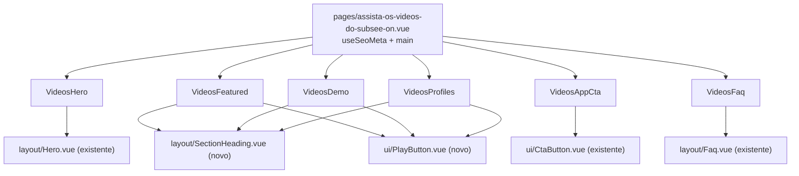

# Assista os vídeos do SUBSEE on Design

**Spec**: `.specs/features/assista-os-videos-do-subsee-on/spec.md`
**Status**: Draft (revisado na Etapa 2)

---

## Architecture Overview

Página estática (Nuxt 4, Vue 3 `<script setup>`, Tailwind v4), sem backend e sem player. Uma página fina em `app/pages/` compõe 6 componentes de `sections/` com prefixo `Videos*` ([[AD-004]]). Cada `section` embrulha um `layout/` existente sempre que a estrutura já existe (`Hero`, `Faq`) e usa markup próprio, dirigido por array tipado, onde o Figma tem anatomia própria (cards). Header e Footer são globais e não entram na página.



### Abordagens consideradas (recomendação primeiro)

| # | Abordagem | Trade-off | Decisão |
|---|---|---|---|
| 1 | **Reusar `Hero` e `Faq`; criar `SectionHeading` (layout) e `PlayButton` (ui) porque cada um tem 3+ chamadores; cards e banner ficam em `sections/` com array tipado** | Segue o `CLAUDE.md` (reuso real, sem abstração de um chamador só). Exige expor 2 props em `Hero.vue` (ver Riscos) | **Recomendada** |
| 2 | Tudo em `sections/`, sem componentes novos em `layout/` e `ui/` | Menos arquivos, mas repete o bloco eyebrow + H2 + descrição em 3 seções e o botão play em 3 lugares | Rejeitada: contradiz "não duplicar markup" do `CLAUDE.md` |
| 3 | Um único `layout/VideoCard.vue` para os cards demonstrativos e os de perfil | Os dois cards têm anatomia diferente (miniatura com duração e play, contra bloco colorido numerado com ícone e link). Um componente com condicionais para os dois é pior que dois `v-for` simples | Rejeitada: só o card demonstrativo tem 3 instâncias iguais; não há segundo chamador real |

---

## Code Reuse Analysis

### Existing Components to Leverage

| Component | Location | How to Use |
| --- | --- | --- |
| `Hero` | `app/components/layout/Hero.vue` | Base do `VideosHero`: slots `heading`, `description`, `visual`; props `moduleIcons`, `dividerSrc`, `mobileDividerSrc`. Mesmo padrão de `BaseConhecimentoHero.vue`, `CrmHero.vue` |
| `Faq` | `app/components/layout/Faq.vue` | Base do `VideosFaq` com `panel-class` sem fundo cinza (padrão de `EventosFaq.vue`, que já passa `plus-icon-src` e `minus-icon-src`) |
| `CtaButton` | `app/components/ui/CtaButton.vue` | Não serve ao botão branco do banner (variantes atuais não incluem fundo branco com texto brand). Usar `<a>` local no `VideosAppCta` (um só chamador) |
| `faq-plus-circle.svg`, `faq-minus-circle.svg` | `public/icons/` | Ícones do FAQ, já usados em `EventosFaq.vue`. Conferir se a cor bate com o Figma (`PlusCircle` preto) |
| Ícones dos módulos do Hero (lançamentos, venda, rural, locação, temporada) | `public/icons/crm-hero-icone-*.svg` | **Reuso comprovado** (Etapa 2): os paths de `venda`, `rural` e `lancamentos-glyph` são idênticos aos exportados do Figma (mesmas dimensões: 16,409×19,017; 17,911×19; 14,137×16,479). `locacao` e `temporada` exportados do Figma trazem o botão inteiro (107,887×110, sombra embutida) com o mesmo glifo; os arquivos existentes são o glifo limpo. Reusar os 5 existentes com o mesmo array `moduleIcons` de `BaseConhecimentoHero.vue` |
| Tokens de cor e fonte | `app/assets/css/main.css` (`--color-brand #5d5fef`, `--color-ink #313846`, `--font-sans Poppins`) | Usar `text-brand`, `text-ink`. Cores fora dos tokens (ver tabela abaixo) como valores arbitrários |
| `container-page` | `app/assets/css/main.css` | Container de todas as seções |

### Não reusáveis (verificado nesta etapa)

| Asset | Motivo |
| --- | --- |
| `public/images/modulos-base-de-conhecimento/hero-visual.png` | Outra foto (homem de camisa branca com tablet); o Figma usa homem de blazer marrom com celular |
| `public/images/modulos-base-de-conhecimento/card_arrow.png` | Cards com texto "Acesso Online" e "Equipe treinada"; o Figma tem "Vídeos Práticos" e "Time Capacitado" |
| `public/icons/crm-hero-divider-onda.svg` | Paths diferentes do divisor do Figma (`3188:3400`, duas linhas: azul `#CEDAFC` e branca, traço de 2px). Usar o do Figma |
| Gradiente de fundo de `Hero.vue` (`119.58deg, #dcfdf4 → #eff0fb → #b2c8f1`) | O Figma usa gradiente horizontal `#E6FDF7` (17%) → `#EFF8F5` (48%) → `#E1E9F9` (100%) com borda inferior curva (path do `Rectangle 4`). Passar `section-class` próprio e usar o SVG do Figma |

### Integration Points

| System | Integration Method |
| --- | --- |
| Header e Footer globais | Nenhuma; a página não os renderiza |
| `HeroMain.vue:83-88` (botão da Home) | Nenhuma nesta feature (Out of Scope); depois, `to` passa de `https://www.youtube.com/@subsee` para `/assista-os-videos-do-subsee-on` |
| Destinos dos links (Q1 a Q3) | **Pendentes.** Enquanto pendentes, uma constante única `videosFallbackUrl` (canal do YouTube, nova aba) centraliza o fallback provisório; não é decisão final e será trocada pelas URLs reais |

---

## Components

### Página `assista-os-videos-do-subsee-on.vue`

- **Purpose**: Compor a página e definir o SEO.
- **Location**: `app/pages/assista-os-videos-do-subsee-on.vue`
- **Interfaces**: `useSeoMeta({ title, description, ogTitle, ogDescription })` com os valores da Q5; template `<main>` com as 6 sections na ordem do Figma.
- **Reuses**: Padrão de `app/pages/eventos.vue`.

### `VideosHero`

- **Purpose**: Hero com H1, descrição, fileira de ícones, foto e cards flutuantes.
- **Location**: `app/components/sections/VideosHero.vue`
- **Interfaces**: sem props; `moduleIcons: HeroModuleIcon[]` local; slot `visual` com foto, imagem de cards e curvas.
- **Dependencies**: `layout/Hero.vue`, foto e composição de cards novas (ver Assets).
- **Reuses**: `BaseConhecimentoHero.vue` (estrutura idêntica: foto + overlay de cards + badge).

### `layout/SectionHeading` (novo)

- **Purpose**: Eyebrow + H2 + descrição opcional, com alinhamento `center` ou `left`.
- **Location**: `app/components/layout/SectionHeading.vue`
- **Interfaces**: props de classe com `withDefaults()` (`wrapperClass`, `eyebrowClass`, `titleClass`, `descriptionClass`); slots `eyebrow`, `title`, `description`. Sem copy dentro.
- **Chamadores reais**: `VideosFeatured` (left), `VideosDemo` e `VideosProfiles` (center).
- **Reuses**: `SectionTag` não serve (tem bolinha teal); o eyebrow do Figma é texto maiúsculo com tracking.

### `ui/PlayButton` (novo)

- **Purpose**: Círculo com triângulo de play, sem comportamento próprio (o link envolvente decide).
- **Location**: `app/components/ui/PlayButton.vue`
- **Interfaces**: props `size` (`lg` 92px, `md` 64px, `sm` 54px) e `circleSrc` (só para `sm`). A variante deriva do tamanho: `lg` (Vídeo institucional) usa círculo branco com borda `#DDE6F6` de 2px, triângulo `#2764F2` e o círculo com sombra exportado como `3188:3434` por trás; `md` (cards demo) usa círculo branco com borda e triângulo `#2764F2`; `sm` (perfis) usa o círculo sólido passado em `circleSrc` (`#5d5fef`, `#159c96` ou `#7652b5`) e triângulo branco. `aria-hidden="true"` sempre. Implementação com os SVGs exportados do Figma, sem redesenhar círculo nem triângulo. (Revisado na T4: a proposta original tinha `variant` separado de `size`; as combinações reais são só estas três.)
- **Chamadores reais**: `VideosFeatured`, `VideosDemo`, `VideosProfiles`.

### `VideosFeatured`

- **Purpose**: Bloco "Vídeo institucional": coluna de texto (eyebrow, H2, descrição, 2 tags) e card de vídeo com gradiente.
- **Location**: `app/components/sections/VideosFeatured.vue`
- **Interfaces**: `tags: string[]` local, um `v-for` sobre um único template de tag.
- **Dependencies**: `SectionHeading`, `PlayButton`.

### `VideosDemo`

- **Purpose**: Galeria de 3 vídeos demonstrativos.
- **Location**: `app/components/sections/VideosDemo.vue`
- **Interfaces**:
  ```typescript
  interface DemoVideo {
    duration: string
    type: string
    title: string
    description: string
    linkLabel: string
    thumbClass: string
    href: string
  }
  ```
  `videos: DemoVideo[]` local, um `v-for`, um template de card.
- **Dependencies**: `SectionHeading`, `PlayButton`.
- **Acessibilidade**: o `<a>` é o link "Assistir ao vídeo →" com pseudo-elemento esticado (`after:absolute after:inset-0`) sobre o card, para um único ponto de tab; `aria-label` com o título.

### `VideosProfiles`

- **Purpose**: 3 cards de perfil numerados.
- **Location**: `app/components/sections/VideosProfiles.vue`
- **Interfaces**:
  ```typescript
  interface VideoProfile {
    number: string
    title: string
    description: string
    linkLabel: string
    bgClass: string
    accentClass: string
    href: string
  }
  ```
  `profiles: VideoProfile[]` local, um `v-for`.
- **Dependencies**: `SectionHeading`, `PlayButton` (variante `brand`), ícone de círculo do Figma.

### `VideosAppCta`

- **Purpose**: Banner de gradiente com título, texto e botão branco.
- **Location**: `app/components/sections/VideosAppCta.vue`
- **Interfaces**: sem props; ícone decorativo (elipse) exportado do Figma.
- **Dependencies**: nenhuma além de assets.
- **Observação**: fica separado de `VideosProfiles` (uma responsabilidade por section, `CLAUDE.md`) e é montado logo depois dele na página.

### `VideosFaq`

- **Purpose**: FAQ com 6 perguntas.
- **Location**: `app/components/sections/VideosFaq.vue`
- **Interfaces**: `faqs: FaqItem[]` local, passado ao `layout/Faq.vue` (cada item tem `question` e `answer`); o item 6 depende da Q4.
- **Reuses**: `EventosFaq.vue` como modelo (props de classe, ícones).

---

## Data Models

Tipos declarados no `<script setup>` de cada section (dados pequenos e de página única; sem JSON em `app/data/`, conforme `CLAUDE.md`). `FaqItem` já é a interface local de `Faq.vue`; `VideosFaq` declara o mesmo shape localmente, como `EventosFaq.vue`.

```typescript
interface FeaturedVideo { badge: string; caption: string; href: string }
```

**Relationships**: nenhuma entre modelos; todos os destinos derivam da constante `videosChannelUrl` até as Q1 a Q3 serem respondidas.

---

## Tokens e tipografia (Figma → implementação)

| Uso | Figma | Implementação |
| --- | --- | --- |
| Fonte | Poppins (Regular 400, Medium 500, SemiBold 600, Bold 700) | `font-sans` (já `--font-sans`) |
| Texto principal | `#313846` | `text-ink` |
| Texto secundário | `#596273` (descrições), `#657083` (texto dos cards demo), `#545567` (cards do Hero) | valores arbitrários `text-[#596273]` etc. |
| Destaque | `#5d5fef` | `text-brand`, `bg-brand` |
| "on" no H1 | `#e72f4d` | `text-[#e72f4d]` |
| Fundo da seção demo | `#f8f9ff` | `bg-[#f8f9ff]` |
| Tag | fundo `#eef0ff`, texto `#5d5fef` 14px Medium, `px-4 py-2.5`, `rounded-full` | classes no `VideosFeatured` |
| Card demo | branco, borda `#e6e8f2`, raio 22px, sombra `0 14px 32px rgba(48,56,77,.08)`, 430×520 | classes no `VideosDemo` |
| Miniaturas | `#5d5fef`→`#8b8dff`, `#17a6a6`→`#66d4c9`, `#7357c7`→`#b491e8` (gradiente à direita, 430×240) | `thumbClass` por item |
| Card de vídeo institucional | thumbnail `featured-thumb.png` com overlay de degradê vertical, raio 28px, `drop-shadow(0 10px 7.5px rgba(46,56,107,.30))`, 760×460 | classes no `VideosFeatured` |
| Perfis | fundos `#eef0ff`, `#eaf9f7`, `#f4eefc`; destaques `#5d5fef`, `#159c96`, `#7652b5`; raio 22px; 430×260 | `bgClass` e `accentClass` por item |
| Banner App | gradiente `#5d5fef`→`#2e386b`, raio 28px, 1400×220; botão branco 300×58, raio 10px, texto `#5d5fef` 15px SemiBold | classes no `VideosAppCta` |
| Eyebrow | 14px SemiBold, tracking 0,84px, `#5d5fef`, maiúsculas | `eyebrowClass` |
| H2 das seções | Poppins Bold 38px (Vídeo institucional, Demonstrativos) e 36px (Perfis) | `titleClass` por chamador |
| H1 do Hero | Poppins Bold 36px, leading 1,2 | ver Riscos (o `Hero.vue` hoje fixa 30px/42px) |
| FAQ | Título 52px SemiBold; pergunta 20px SemiBold leading 20; resposta 16px leading 26 | props de `Faq.vue` |

---

## Layout e espaçamento (1920px, container de 1400px)

| Seção | Altura no Figma | Estrutura |
| --- | --- | --- |
| Hero | 568 (fundo 548 + onda) | `Hero.vue`; texto em x=259 (H1 555px, descrição 630px, ícones em y=401) |
| Vídeo institucional | 565 (`py-10` + 485) | Duas colunas de 520 e 760px, gap 96px; card no topo do container de 485px, coluna de texto 20px abaixo do topo |
| Vídeos demonstrativos | 874 (`py-10` + 794) | Faixa `#f8f9ff` de largura total com `py-10`; intro (162px) + gap 32px + galeria 3×430 com gap 55px (=1400) |
| Conteúdo por perfil + banner | 814 (`py-10` + 438 + gap 76 + 220 + ...) | Intro, lista 3×430 com gap 55px, gap 76px, banner de 1400×220 |
| FAQ | 1063 (`pt-10 pb-20`) | Itens centralizados com 970px de largura útil |

---

## Responsividade

O Figma só define 1920px; o restante deriva dos breakpoints do projeto (`mobile-lg` 576, `tablet` 768, `tablet-lg` 992, `desktop-compact` 1200, `desktop` 1300, `desktop-full` 1400, `desktop-lg` 1600) e das páginas irmãs.

| Faixa | Comportamento |
| --- | --- |
| `< tablet-lg` (992) | Hero como nas páginas irmãs (`Hero.vue` empilha texto e visual, esconde a composição absoluta). Vídeo institucional em coluna única (texto, depois card com `aspect-[760/460]`). Galerias em coluna única. Banner: texto e botão empilhados |
| `tablet-lg` a `desktop` | Vídeo institucional em duas colunas com larguras fluidas; galerias em 3 colunas com `gap` reduzido e cards fluidos (`min-w-0`) |
| `>= desktop-full` | Larguras do Figma (430, 760, 520, 970) |
| Regra | `.container-page` pinça texto logo abaixo de cada breakpoint; conferir quebras em 991, 1199 e 1299px |

---

## Assets (a exportar do Figma na Etapa 2; nada foi baixado)

Lista completa, com node ids, dimensões e decisão de cada arquivo, no manifesto. Inspecionados na Etapa 2 (baixados só para uma pasta temporária; nada foi gravado em `public/`). Resumo: 1 PNG (foto do Hero, RGBA) e 28 SVGs. Reuso de arquivos existentes: 5 ícones de módulo do Hero e 1 ícone de FAQ (`faq-plus-circle.svg` tem paths idênticos ao `PlusCircle` do Figma; o `faq-minus-circle.svg` existente equivale visualmente ao estado aberto do item 6, com o traço vertical branco invisível sobre fundo branco). Todo o resto é exportado do Figma para esta página. As URLs de asset do MCP expiram em 7 dias; a Etapa 3 refaz o `get_design_context` antes de baixar. Os cards flutuantes do Hero ("Vídeos Práticos" e "Time Capacitado") são desenhados como HTML/CSS com os ícones SVG do Figma, no padrão de `SiteUrbanoHero.vue`, ou compostos numa imagem única, como `card_arrow.png`; **decidido na T7:** HTML/CSS, com todas as posições e tamanhos da composição em unidades `cqw` (relativas à largura do bloco visual, que ganha `container-type: inline-size`), para escalar junto com o container; a forma curva do fundo entra como máscara da seção a partir de `tablet-lg` (`mask-image` com `videos-hero-bg.svg`, `mask-size: 100% 548px`, `mask-position: 0 -85px`, altura do header), o que recorta o corpo do homem na onda como no Figma. A foto é espelhada horizontalmente, como no frame do Figma.

## Estados

| Elemento | Estados |
| --- | --- |
| Cards demonstrativos e de perfil, links | Repouso (Figma). Hover, foco e ativo não existem no Figma: hover com leve elevação de sombra e `focus-visible` com `outline-brand`, iguais aos outros cards do site |
| FAQ | Fechado (padrão) e aberto (+ para −), nativo do `layout/Faq.vue` |
| Botão do banner | Repouso (Figma); hover `bg-white/90` |

---

## Error Handling Strategy

| Error Scenario | Handling | User Impact |
| --- | --- | --- |
| Foto do Hero não carrega | `NuxtImg` com dimensões fixas; fundo em gradiente permanece | Hero sem foto, texto legível |
| Destino de vídeo indefinido (Q1 a Q3) | Fallback provisório: `href` para o canal, `target="_blank"` e `rel="noopener"` | Abre o canal do YouTube (provisório) |
| Resposta do FAQ 6 indefinida (Q4) | Item sem texto de resposta, ou item omitido até a decisão | Sem conteúdo inventado |

---

## Risks & Concerns

| Concern | Location (file:line) | Impact | Mitigation |
| --- | --- | --- | --- |
| `Hero.vue` fixa o tamanho do H1 (`text-[32px] tablet-lg:text-[30px] desktop-full:text-[42px]`) e da descrição (`desktop-full:text-[24px]`, `max-w-[675px]`); o Figma usa 36px, 20px e 630px | `app/components/layout/Hero.vue:69-72` | O Hero da nova página sairia com tipografia diferente do Figma | Expor `headingClass` e `descriptionClass` como props com `withDefaults()` iguais aos valores atuais (sem mudar nenhuma página existente). Alteração pequena e aditiva num shell compartilhado. Verificado na Etapa 2: os 9 chamadores (`ApisHero`, `BaseConhecimentoHero`, `CrmHero`, `CrmRuralHero`, `CrmTemporadaHero`, `CrmUrbanoHero`, `SiteLoteadorasHero`, `SiteRuralHero`, `SiteUrbanoHero`) usam o `<h1>` e o `<p>` do padrão e nenhum passa as novas props; o valor padrão de cada uma é a string de classes que existe hoje, então o HTML gerado para essas páginas não muda. Na Etapa 3, confirmar com `pnpm build` e comparação do HTML de um chamador antes e depois |
| `Hero.vue` usa `aspect-[1401/528]` (528px a 1400px de largura); o Figma tem 548px de fundo | `app/components/layout/Hero.vue:35` | Altura do Hero pode divergir alguns pixels | Comparar com o screenshot na Etapa 2; ajustar via `aspectClass` do `VideosHero` (prop já existe) |
| Composição da foto do Hero: PNG transparente 1536×1024 (RGBA) enquadrado em janela de 344×451 (largura 196,66%, deslocamento −51,38%), com elipse branca desfocada (951×1058, blur 150) por trás e recorte pela forma curva do fundo do Hero | Figma `3188:3628` a `3188:3630` | Sem o recorte, o corpo do homem invade a onda inferior; sem a elipse desfocada, falta o brilho atrás da foto | O MCP entregou o PNG **com** transparência (verificado nesta etapa, ao contrário do caso de [[AD-014]]); reproduzir o enquadramento com `object-cover` e posicionamento, e conferir o recorte com screenshot na Etapa 3 |
| O fundo do Hero da página (gradiente horizontal com borda inferior curva) e o divisor (2 linhas) não são os de `Hero.vue` nem de `crm-hero-divider-onda.svg` | `app/components/layout/Hero.vue:30` | Hero com fundo e onda diferentes do Figma se os padrões forem mantidos | `section-class` e `divider-src` próprios em `VideosHero`; nenhuma mudança nos padrões das outras páginas |
| Sem vídeos, títulos e durações confirmados (Q1) | `VideosFeatured`, `VideosDemo` | Página com conteúdo de demonstração no ar | Manter a lista de pendências no manifesto e destinos interinos centralizados numa constante |
| O bug conhecido de `translate-*` sem CSS ([[AD-007]]) afeta o código gerado pelo Figma (`-translate-x-1/2`) | Código de referência do Figma | Centralização errada do botão play e do texto do botão do banner | Centralizar com flexbox (`items-center justify-center`) |
| O nome da camada do título do card 3 dos vídeos demonstrativos (`3188:3472`) é "Heading / H2", enquanto os cards 1 e 2 são "Heading / H3" | `3188:3472` | Hierarquia de headings inconsistente se copiada | Usar `<h3>` nos três cards |
| Item 03 do FAQ tem o texto de resposta desalinhado 6,5px do padrão dos outros (x 211,7 contra 218,3) | `3188:3536` | Imperfeição do design, não intencional | Não replicar; usar o alinhamento comum |

---

## Tech Decisions (só as não óbvias)

| Decision | Choice | Rationale |
| --- | --- | --- |
| Reprodução de vídeo | Nenhum player; cards são links | O Figma não define reprodução; embed exige decisão de produto (Q1) |
| Clique no card | Link esticado com pseudo-elemento em vez de envolver o card em `<a>` | Um único ponto de tab e HTML válido (sem interativo dentro de interativo) |
| Prefixo de sections | `Videos*` | Sem colisão hoje; curto e específico da página ([[AD-004]]) |
| Cores fora dos tokens | Valores arbitrários no componente | Usadas só nesta página; promover a token só se aparecerem em uma segunda |

> **Decisão de nível de projeto**: nenhuma nova. Se a alteração aditiva em `Hero.vue` (props de classe para H1 e descrição) for aprovada, registrar como `AD-017` no `.specs/STATE.md` na Etapa 2, pois vira convenção do shell compartilhado.

---

## Relação Figma → implementação

| Figma (node) | Componente |
| --- | --- |
| Section / Hero / Top `3188:3398` | `VideosHero` (`layout/Hero.vue`) |
| Section / Content / Featured Video `3188:3420` | `VideosFeatured` |
| Section / Content / Demo Videos `3188:3438` | `VideosDemo` |
| Section / Content / By Profile `3188:3474` (lista `3188:3476`) | `VideosProfiles` |
| CTA - App SUBSEE `3188:3501` | `VideosAppCta` |
| Section / Hero / FAQ `3188:3507` | `VideosFaq` (`layout/Faq.vue`) |
| Header `3188:3559`, Footer `3188:3558` | Componentes globais existentes |

Referência do Hero-pattern existente: `BaseConhecimentoHero.vue`, `SiteUrbanoHero.vue`, `SiteRuralHero.vue` (regra do `CLAUDE.md`: foto + overlay de cards + badge, sem achatar tudo num PNG).
