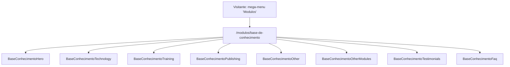

# Base de Conhecimento (`/modulos/base-de-conhecimento`) Design

**Spec**: `.specs/features/base-de-conhecimento/spec.md`
**Status**: Draft

---

## Architecture Approaches Considered

| # | Approach | Trade-off | Verdict |
| - | -------- | --------- | ------- |
| 1 | **Dedicated static page** — `app/pages/modulos/base-de-conhecimento.vue` compõe 8 seções (`BaseConhecimento*.vue`), reaproveitando `layout/` shells por wrapper fino onde a estrutura já bate (Hero, Technology→Training, Portfolio→Training, Testimonials, Faq) e componentes bespoke onde não há shell genérico (Publishing/Vantagens, Content/Other, Other Modules) | Nenhum de nota — é o padrão já validado em `/modulos/apis-hub-integrador` e nas demais páginas `/modulos/*` | **Recomendado** |
| 2 | Reconstruir a imagem "devices-composition" (seção Content/Other) em HTML/CSS puro em vez de exportá-la do Figma | A estrutura (janela+sidebar+cards+mobile mockup) é relativamente limpa, mas envolve dezenas de textos/ícones decorativos a mais para manter fiel ao Figma; nenhuma página do site reconstrói esse tipo de composição em HTML — todas usam imagem exportada (`AD-011`, `ApisConecte.vue`/`conecte.png`) | Rejeitado — manter consistência com o padrão já estabelecido; tratar como asset de imagem pendente |
| 3 | Reaproveitar `CrmAllInOne.vue` diretamente para a seção Publishing/Vantagens | `CrmAllInOne.vue` tem conteúdo hardcoded específico do CRM (zero props); forçar reuso exigiria refatorar um componente já publicado em produção — mesmo raciocínio já registrado no design de `apis-hub-integrador` para `ApisBenefits.vue` | Rejeitado — criar `BaseConhecimentoPublishing.vue` bespoke, mesmo padrão de `ApisBenefits.vue` |

**Decisão**: Approach 1. Reflete as decisões já confirmadas no `spec.md` (Assumptions & Open Questions).



---

## Code Reuse Analysis

### Existing Components to Leverage

| Component | Location | How to Use |
| --- | --- | --- |
| `layout/Hero.vue` | `app/components/layout/Hero.vue` | Base do `BaseConhecimentoHero.vue` — badge/H1/descrição/ícones de módulo + slot `#visual` com a composição foto+cards pré-composta (`card_arrow.png`), mesmo padrão de `CrmHero.vue`/`ApisHero.vue` ([[AD-012]]) |
| `layout/Technology.vue` | `app/components/layout/Technology.vue` | Base do `BaseConhecimentoTechnology.vue` — heading/descrição/CTA + mockup (`technology-mockup.png`). Reaproveitar via `CrmTechnology.vue` (wrapper de props já com defaults de CTA/curva/estrela) como no exemplo `ApisTechnology.vue` |
| `layout/Portfolio.vue` | `app/components/layout/Portfolio.vue` | Base do `BaseConhecimentoTraining.vue` (seção 3) — a estrutura (heading/lead + `#image` + `#summary` com features[] + CTA) bate exatamente, mesmo padrão de `ApisIntegrationsHub.vue` |
| `layout/Testimonials.vue` | `app/components/layout/Testimonials.vue` | Base do `BaseConhecimentoTestimonials.vue`, mesmo padrão de `ApisTestimonials.vue` (filtra `app/data/testimonials.json` por array de `id`, passa só `:testimonials` + `section-id`) |
| `sections/CrmFaq.vue` | `app/components/sections/CrmFaq.vue` | Base do `BaseConhecimentoFaq.vue`, wrapper fino idêntico a `ApisFaq.vue` (reaproveita `CrmFaq.vue` → `layout/Faq.vue`, ícones "+"/"−" já existentes via defaults de `CrmFaq.vue`) |
| `CtaButton.vue` | `app/components/ui/CtaButton.vue` | Todos os CTAs "Testar grátis por 30 dias" (variant `primary`, `to="/testar-gratis"`) |
| `SectionTag.vue` | `app/components/ui/SectionTag.vue` | Tag "base de conhecimento" da seção Content/Other (avaliar durante implementação se o componente existente cobre o estilo uppercase/chip roxo do Figma, senão manter markup local como `ApisConecte.vue` já faz) |
| `app/data/testimonials.json` | — | Reaproveitado sem alteração — filtra pelos ids `crm-geral-mauro-alencar` e `crm-rural-julio-silveira` |
| `/icons/crm-hero-icone-*.svg` | `public/icons/` | Fileira de 5 ícones de módulo do Hero — mesmos arquivos já usados em `CrmHero.vue`/`ApisHero.vue` |
| `/icons/faq-plus-circle.svg` / `faq-minus-circle.svg` | `public/icons/` | Ícones do accordion FAQ ([[AD-008]]) |

### Integration Points

| System | Integration Method |
| --- | --- |
| `HeaderBar.vue` mega-menu | Já linka para `/modulos/base-de-conhecimento` (coluna "INTEGRAÇÕES E HABILIDADES", badge "novo") — confirmado, sem alteração necessária. |
| `ApisOtherModules.vue` (feature `apis-hub-integrador`, já publicada) | Seu banner "Base de conhecimento" ainda usa `href="#"` — fora do escopo desta feature (ver `spec.md` Out of Scope), mas documentado aqui como follow-up natural após esta página existir. |
| Figma → content pipeline | `get_design_context`/`get_metadata` node a node → `FIGMA_CONTENT_MANIFEST_BASE_CONHECIMENTO.md` (já escrito) → 4 assets de imagem já existentes e confirmados em `public/images/modulos-base-de-conhecimento/` (`hero-visual.png`, `card_arrow.png`, `technology-mockup.png`, `portfolio-telas-base-conhecimento.png`) + ícones pendentes (ver spec) → componentes escritos a partir do manifesto. |

---

## Components

Todas as 8 seções são Vue 3 `<script setup>` SFCs, prefixo `BaseConhecimento`. As que envolvem `layout/` usam `withDefaults()` só para as poucas props/slots necessários (padrão de `CrmHero.vue`/`CrmTechnology.vue`); as bespoke seguem o padrão hardcoded-sem-props de `CrmAllInOne.vue`/`ApisConecte.vue`/`ApisOtherModules.vue`.

### `app/pages/modulos/base-de-conhecimento.vue`
- **Purpose**: Route entry point; compõe as 8 seções na ordem do Figma, `useSeoMeta`.
- **Reuses**: padrão de `app/pages/modulos/apis-hub-integrador.vue`.

### `BaseConhecimentoHero.vue` — node `3164:37762`
- **Purpose**: Hero/top — H1, descrição, ícones de módulo, composição visual foto+cards.
- **Dependencies**: `layout/Hero.vue`, `hero-visual.png` (já existe), `card_arrow.png` (já existe), badge de canto `conhecimento.svg` (pendente de download).
- **Sem CTA** (confirmado no manifesto).

### `BaseConhecimentoTechnology.vue` — node `3168:40055`
- **Purpose**: Heading/descrição/CTA + mockup estático.
- **Dependencies**: `sections/CrmTechnology.vue` (wrapper de `layout/Technology.vue`), `technology-mockup.png` (já existe), `CtaButton`.

### `BaseConhecimentoTraining.vue` — node `3168:40734`
- **Purpose**: Bloco imagem+features do treinamento da equipe (H2/descrição no nível Bloco + imagem + Coluna 02 com descrição secundária, 4 itens de feature, CTA).
- **Dependencies**: `layout/Portfolio.vue`, `portfolio-telas-base-conhecimento.png` (já existe), 4 ícones pendentes de download, `CtaButton`.
- **Nota**: `layout/Portfolio.vue` já suporta heading/lead (nível painel) + summary+features (nível coluna de texto) — mapeamento direto, sem necessidade de props novas no shell.

### `BaseConhecimentoPublishing.vue` — node `3164:38449`
- **Purpose**: Grid de 3 cards de vantagem (ícone circular sobreposto + H3 + descrição).
- **Dependencies**: nenhum shell genérico — bespoke, padrão `ApisBenefits.vue`/`CrmAllInOne.vue`. 3 ícones pendentes de download (team/training/satisfaction).

### `BaseConhecimentoOther.vue` — node `3164:38481`
- **Purpose**: Bloco duas-colunas (tag+H2+descrição+trust-indicator+CTA / imagem "devices-composition").
- **Dependencies**: `SectionTag` (ou markup local), `CtaButton`. Bespoke — mesmo padrão estrutural de `ApisConecte.vue`, mas com uma linha extra de trust-indicator (ícone shield-check + texto) entre a descrição e o CTA.
- **Nota**: imagem "devices-composition" é asset pendente (ver spec Assumptions) — usar `NuxtImg` com `src` documentado apontando para `public/images/modulos-base-de-conhecimento/devices-composition.png` (a exportar do Figma na fase de Execute).

### `BaseConhecimentoOtherModules.vue` — node `3164:38607`
- **Purpose**: Header + banner único "APIs e HUB Integradores" (não é grid de cards).
- **Dependencies**: nenhum shell — bespoke, literal único (não uma lista de N=1), mesmo padrão de `ApisOtherModules.vue` mas apontando para `/modulos/apis-hub-integrador`.
- **Nota**: ícone do banner — tentar `/icons/menu-icone-apis-hub.svg` primeiro (ver spec Assumptions); confirmar visualmente contra o Figma antes de decidir se precisa de export dedicado.

### `BaseConhecimentoTestimonials.vue` — node `3164:38612`
- **Purpose**: 2 depoimentos reaproveitados de `testimonials.json`.
- **Dependencies**: `layout/Testimonials.vue`.

### `BaseConhecimentoFaq.vue` — node `3168:40951`
- **Purpose**: Accordion de 6 perguntas/respostas.
- **Dependencies**: `sections/CrmFaq.vue` (que já encapsula `layout/Faq.vue` + ícones "+"/"−" via defaults).
- **Reuses**: `ApisFaq.vue:1-46` como referência de wrapper (mesmo shape de props — array `faqs` local + slots `#title`/`#description`).

---

## Data Models (local content shapes, not persisted)

```typescript
// BaseConhecimentoHero.vue
interface ModuleIcon { src: string; alt: string } // reaproveita HeroModuleIcon de layout/Hero.vue

// BaseConhecimentoTraining.vue — mirrors PortfolioFeature de layout/Portfolio.vue
interface TrainingFeatureItem { icon: string; title: string; description: string }

// BaseConhecimentoPublishing.vue
interface AdvantageCard { icon: string; iconWidth: number; iconHeight: number; title: string; description: string }

// BaseConhecimentoOtherModules.vue — literal único, não array
interface OtherModuleBanner {
  icon: string
  title: string        // "APIs e HUB Integradores"
  description: string  // "Integre sistemas e automatize fluxos de trabalho via API."
  linkLabel: string     // "Clique aqui"
  linkHref: string      // "/modulos/apis-hub-integrador"
}

// BaseConhecimentoFaq.vue — mirrors CrmFaq.vue's `faqs` shape
interface FaqItem { question: string; answer: string }
```

**Relationships**: nenhuma — cada array é local ao seu componente. `BaseConhecimentoTestimonials.vue` é a única exceção, lendo de `app/data/testimonials.json` (compartilhado, não modificado).

---

## Error Handling Strategy

| Error Scenario | Handling | User Impact |
| --- | --- | --- |
| Imagem "devices-composition" ainda não exportada no momento da implementação | `NuxtImg` aponta para o caminho documentado (`devices-composition.png`); se o arquivo não existir no momento do `pnpm build`, a task de implementação correspondente permanece bloqueada até o export — não se inventa uma composição HTML aproximada (ver spec Edge Cases) | Sem impacto para o usuário final se resolvido antes do merge; documentado explicitamente para não virar um "quase certo" silencioso |
| Ícone do banner "Other Modules" não bate visualmente com `/icons/menu-icone-apis-hub.svg` | Exportar ícone dedicado do node `3164:38611` do Figma | Nenhum — decisão resolvida antes do merge |
| Imagem/ícone não carrega | `alt` text padrão, sem retry/placeholder — mesmo padrão do resto do site | Ícone quebrado no navegador; coberto pela auditoria de QA final |

---

## Risks & Concerns

| Concern | Location | Impact | Mitigation |
| --- | --- | --- | --- |
| Asset "devices-composition" pendente de exportação (não é apenas ícone, é uma imagem estruturalmente complexa) | `BaseConhecimentoOther.vue` | Se o export do Figma expirar (~7 dias) antes da implementação, precisa ser refeito | Priorizar o download deste asset logo no início da fase de Execute, junto dos demais ícones pendentes |
| `href` do CTA "Testar grátis por 30 dias" assumido como `/testar-gratis` sem confirmação explícita nova (mesma assunção já usada em todas as páginas de módulo) | 3 seções (`BaseConhecimentoTechnology`, `BaseConhecimentoTraining`, `BaseConhecimentoOther`) | Risco nulo — rota já confirmada existente e usada em 27+ arquivos do site | Nenhuma ação necessária |
| Banner "Base de conhecimento" em `ApisOtherModules.vue` continua com `href="#"` após esta feature | `app/components/sections/ApisOtherModules.vue` (fora do escopo) | Inconsistência de navegação cross-page (uma página já aponta pra outra, a outra ainda não aponta de volta corretamente) | Registrado como Out of Scope no `spec.md`; recomendado como próxima tarefa pequena após o merge desta feature |
| Nenhum test runner ([[AD-002]]) | n/a | Gate de task não pode ser "testes passam" literalmente | Gate = `pnpm build` + verificação manual/visual por critério de aceite |

> Todos os riscos identificados têm mitigação acima; nenhum bloqueia a aprovação do Design.

---

## Tech Decisions (feature-local only)

| Decision | Choice | Rationale |
| --- | --- | --- |
| Route file | `app/pages/modulos/base-de-conhecimento.vue` | Roteamento por arquivo do Nuxt; já é o slug usado no link existente do mega-menu |
| Prefixo dos componentes | `BaseConhecimento` | Sem colisão, segue [[AD-004]] |
| Section anchor IDs | kebab-case, baseado em conteúdo (ex.: `id="base-conhecimento-tecnologia"`, `id="base-conhecimento-duvidas-frequentes"`) | Mesmo padrão de `id="apis-tecnologia"`/`id="apis-duvidas-frequentes"` |
| Seção 3: reaproveitar `layout/Portfolio.vue` diretamente (não criar um segundo shell) | Confirmado adequado | Estrutura bate 1:1, mesmo padrão já usado por `ApisIntegrationsHub.vue` |
| Seção 5: componente próprio em vez de reexportar `ApisConecte.vue` | `BaseConhecimentoOther.vue` novo | Mesma decisão já tomada no design de `apis-hub-integrador` (texto/imagem por página, sem props de imagem no componente original) — se uma 3ª página repetir esse padrão exato, reavaliar promoção para `layout/` |

Nenhuma decisão de projeto nova surgiu durante o Design que exija um novo `AD-NNN` em `STATE.md` — [[AD-001]] a [[AD-016]] já cobrem as escolhas cross-cutting necessárias. A única observação nova (banner cross-page com `href="#"` pendente em `apis-hub-integrador`) é local a esta feature, não uma decisão arquitetural.

---

## Requirement Traceability (Design pass)

Reflete conceitualmente a coluna `Phase` do `spec.md` de `Pending` para `In Design`. Os 14 `BC-NN` mapeiam para as 8 seções + 1 task de manifesto (já concluída nesta sessão) + 1 task de QA responsiva/SEO, a formalizar em `tasks.md` na Etapa 2 (Tasks), ainda não executada — aguardando aprovação do usuário para esta Etapa 1 (Specify + Design).
