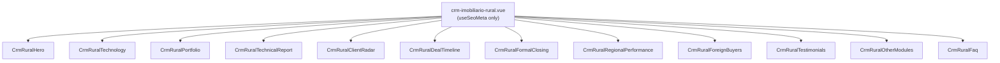

# CRM Imobiliário Rural Design

**Spec**: `.specs/features/crm-imobiliario-rural/spec.md`
**Status**: Draft

---

## Architecture Overview

Static marketing page, same pattern as `/modulos/crm`: one Nuxt page (`app/pages/modulos/crm-imobiliario-rural.vue`) composing 12 self-contained `CrmRural*` section components in `<main>`, no props/emits, no shared state. Each component owns its own hardcoded content (`AD-001`) and is a straight pull from `FIGMA_CONTENT_MANIFEST_CRM_RURAL.md`.

No new architectural layer, no data model, no API integration — this is presentational Vue/Tailwind only. The interesting design work is entirely at the component level: **which of the 12 sections get a static exported image vs. real markup**, and **the internal structure of the 5 patterns that have no precedent anywhere else in the codebase**.

---

## Code Reuse Analysis

### Existing Components to Leverage (technical reference only — not visual)

| Component | Location | How to Use |
| --- | --- | --- |
| `CrmHero.vue` | `app/components/sections/CrmHero.vue` | Reference for photo + floating-card composition + bottom wave divider technique (percentage-based absolute positioning on desktop, stacked full-width clone on mobile/tablet) — layout/copy differ per Figma |
| `CrmTestimonials.vue` | `app/components/sections/CrmTestimonials.vue` | Reference for 2-card testimonial block structure (lavender rounded block, equal-height cards) — `CrmRuralTestimonials.vue` clones structure, real content differs (2 logos per card here, not 1) |
| `CrmOtherModules.vue` | `app/components/sections/CrmOtherModules.vue` | Reference for cross-sell card list (`OtherModuleCard[]` local array, `NuxtLink` + icon badge + "Clique aqui →" pill) — `CrmRuralOtherModules.vue` clones structure, module list differs (includes generic CRM, excludes Rural) |
| `CrmFaq.vue` | `app/components/sections/CrmFaq.vue` | Direct pattern reuse (not just reference) — native `
/
`, `faq-plus-circle.svg`/`faq-minus-circle.svg` icons (`AD-008`). No divergence needed here: the Rural Figma node already uses the same "+/−" icon this component already implements. |
| `CrmTechnology.vue` | `app/components/sections/CrmTechnology.vue` | Reference for "H2 + description + CTA + large static mockup image" pattern, and for the local `mx-auto w-full max-w-[1400px]` wrapper used when a section needs literal 1400px Figma fidelity that `.container-page`'s stepped widths can't give |
| `.container-page` / `.section-py` | `app/assets/css/main.css` | Reused for all 12 sections' outer spacing per `CLAUDE.md` |

### Integration Points

| System | Integration Method |
| --- | --- |
| `HeaderBar.vue` mega-menu | One-line `to` fix for the existing "CRM Imobiliário Rural" item (`/modulos` → `/modulos/crm-imobiliario-rural`) |
| `CrmOtherModules.vue` (on `/modulos/crm`) | One-line `href` fix for its "CRM Imobiliário Rural" card (`/modulos/rural` → `/modulos/crm-imobiliario-rural`) |
| `HeroRural.vue` (on Home) | One-line CTA fix (`/modulos/rurais` → `/modulos/crm-imobiliario-rural`) |
| `@nuxt/image` (`NuxtImg`/`NuxtPicture`) | Used for every static-mockup asset per section (see table below) |

---

## Components

All 12 are `<script setup>` SFCs with zero props, following `crm.vue`'s established shape. Only the 5 with no sitewide precedent get a dedicated design note below; the other 7 are direct applications of an existing pattern (see Code Reuse Analysis) and don't need new interfaces.

### CrmRuralHero

- **Purpose**: H1 + description + photo/mockup composition with 2 floating cards, per Hero/Top node `3556:5778`.
- **Location**: `app/components/sections/CrmRuralHero.vue`
- **Reuses**: `CrmHero.vue`'s floating-card + wave-divider technique. Photo+phone+map composition (`Imagem`/`Mobile`/`Mapa` sub-tree) exported as one static image — too many nested masked SVG layers to recreate live, no different in kind from `CrmTechnology.vue`'s dashboard mockup.

### CrmRuralClientRadar — novel pattern

- **Purpose**: Two-column "how it works" block: a left info-card containing 3 numbered mini-steps + a result banner, and a right column with heading/copy/checklist/CTA.
- **Location**: `app/components/sections/CrmRuralClientRadar.vue`
- **Structure**: Outer gradient block (`rounded-[50px]`, border `#e5e7eb`) → flex row → Card (`rounded-[28px]`, `#fbfcff`) containing: tag pill "COMO FUNCIONA" → title → subtitle → 3 mini-cards in a row (each: numbered pill badge with a distinct pastel color per step, bold title, description) → gradient result banner (status dot + 2-line copy). All markup, no images.
- **Dependencies**: none beyond Tailwind utilities already in the project (gradients, `rounded-[Npx]`, pill badges — same techniques as `CrmAllInOne.vue`'s feature cards).
- **Reuses**: card/badge visual language already established across `Crm*` components (rounded cards, pill tags, checkmark list) — no new visual primitive, just a new arrangement.

### CrmRuralDealTimeline — novel pattern

- **Purpose**: Horizontal 4-stop timeline (visit → proposal → negotiation → closing) inside a gradient block, with a connecting line and per-stop colored dot + label + sublabel.
- **Location**: `app/components/sections/CrmRuralDealTimeline.vue`
- **Structure**: A local typed array of 4 `{ color, size, label, sublabel }` entries rendered with `v-for` inside a `flex justify-between items-center` row over a `absolute` connecting line (`bg-[#c5c4d7] h-[3px]`) — avoids hand-positioning 4 near-identical blocks with `x`/`y` pixel offsets copied from Figma. Each dot is a plain `rounded-full` div with `border-4 border-white`; the last dot is visually larger (`size-[50px]` vs `size-[35px]`) per the real Figma measurements. No CTA in this section (confirmed in the manifest — do not add one).
- **Dependencies**: none.
- **Reuses**: same checklist-row pattern as other sections for the 3 bullet items below the timeline.

### CrmRuralFormalClosing — novel pattern

- **Purpose**: Two-column block: left is heading/copy/checklist/CTA, right is a "Contrato de Arrendamento" document-preview card with a cursive signature and an "assinado eletronicamente" seal.
- **Location**: `app/components/sections/CrmRuralFormalClosing.vue`
- **Structure**: Card = colored header bar (`#00d39b`) + title, body = a stack of `bg-[#f4f4f7] h-[10px] rounded-[4px]` bars simulating text lines (decorative, matches Figma's own placeholder-line technique — these are genuinely rectangles in the Figma source, not real paragraph text, so recreating them as divs is fidelity, not a shortcut), a divider line, the signature line ("Assinatura eletrônica do proprietário") and the cursive name "João da Silva".
- **Font decision**: Figma uses "Amostely Signature". **Action for the implementing task**: check Google Fonts for this exact family; if unavailable, apply `font-family: cursive` (generic fallback) to preserve the manuscript look without fabricating a visually-different named font. Do not substitute a different named signature font without flagging it as a `SPEC_DEVIATION` in the manifest.
- **Reuses**: circular seal icon downloaded as a single SVG asset (small, self-contained — not worth decomposing).

### CrmRuralRegionalPerformance — novel pattern

- **Purpose**: Two-column block: left is heading/copy/checklist/CTA, right is a "Desempenho por região" dashboard card combining a static map image with 3 real stat cards stacked beside it.
- **Location**: `app/components/sections/CrmRuralRegionalPerformance.vue`
- **Structure**: Card header (title + pill filter "Últimos 30 dias") → flex row: static map image (left, `rounded-[18px]`, `NuxtImg`) + column of 3 stat cards (right, real markup: label eyebrow, big number, small delta/context line — same visual shape as a KPI card, nothing novel there) + a small "Dados atualizados" status row beneath.
- **Reuses**: KPI/stat-card shape is a common enough pattern it doesn't need its own primitive; the map itself (satellite imagery + custom pins + shaded region overlays) is the one part that must be a static export — recreating a georeferenced map with custom shaded polygons live is out of proportion to this feature's value, consistent with the project's existing mockup-as-image precedent.

### CrmRuralForeignBuyers — novel pattern

- **Purpose**: A "vitrine" of 5 overlapping, individually-rotated property cards (Uruguai, Paraguai, Bolívia, Argentina, and a larger featured "Fazenda disponível" card), plus a row of 5 country-chip pills below.
- **Location**: `app/components/sections/CrmRuralForeignBuyers.vue`
- **Structure**: The overlapping/rotated card composition (5 cards, each independently rotated -7°/-3°/0°/+3°/+7°, absolutely positioned, several with cropped/masked photos) is exported as **one static image** — recreating 5 independently-rotated, overlapping cards with real DOM elements would require the exact same pixel-perfect absolute positioning Figma already solved, with no reuse value (nothing else on the site rotates/overlaps cards like this) and high fragility across breakpoints. The country-chip row below (bolinha colorida + name, 5 items) **is** real markup — trivial flex row, no reason to flatten it.
- **Reuses**: none — this is the one section with no precedent pattern to lean on; treated as illustrative content, same tier as the Home page's product screenshots.

### Other 7 sections (direct pattern application, no new design needed)

`CrmRuralTechnology` (H2+CTA+static mockup, like `CrmTechnology.vue`), `CrmRuralPortfolio` (H2+static mockup+4 feature items+CTA), `CrmRuralTechnicalReport` (H2+checklist+CTA+real "Ficha da propriedade" data-grid card — same KPI/data-card shape as Regional Performance's stat cards, just a bigger grid), `CrmRuralTestimonials` (clone of `CrmTestimonials.vue`), `CrmRuralOtherModules` (clone of `CrmOtherModules.vue`), `CrmRuralFaq` (direct reuse of `CrmFaq.vue`'s pattern).

---

## Data Models

N/A — no data, no forms, no API calls. All content is literal template markup per `AD-001`.

---

## Error Handling Strategy

N/A — static content page, no user input, no async operations (consistent with the Implicit-Requirement Dimensions sweep in `spec.md`).

---

## Risks & Concerns

| Concern | Location | Impact | Mitigation |
| --- | --- | --- | --- |
| Signature font ("Amostely Signature") availability unconfirmed | `CrmRuralFormalClosing.vue` (new) | If loaded from an unverified CDN/source, could add an unvetted external font dependency or silently fall back to a generic sans-serif, breaking the "handwritten signature" visual intent | Check Google Fonts first; if absent, explicitly set `font-family: cursive` rather than leaving the browser default — decided in Assumptions table of `spec.md`, not left to implementation-time guesswork |
| `translate-x-*`/`translate-y-*` sitewide bug (`AD-007`) | All new components, especially `CrmRuralHero.vue`'s composition and `CrmRuralClientRadar.vue`'s badges | Any element positioned with this utility combo silently fails to center/offset | Every new component uses flexbox centering or `calc()`-based positioning, never `-translate-x-1/2`/`-translate-y-1/2`, per `CLAUDE.md` and `AD-007` |
| 5 static-image compositions (Hero, Technology, Portfolio, Regional Performance, Foreign Buyers) depend on Figma asset URLs that expire in ~7 days | `FIGMA_CONTENT_MANIFEST_CRM_RURAL.md` | If assets aren't downloaded promptly during Execute, the manifest's asset URLs go stale and images break | Task order in `tasks.md` downloads all assets (via `download_assets`/`upload_assets` or direct fetch) in the same task that extracts each section, not deferred to a later batch |

---

## Tech Decisions

| Decision | Choice | Rationale |
| --- | --- | --- |
| Deal Timeline stops | Rendered from a local typed array + `v-for`, not 4 hand-copied blocks | 4 near-identical blocks differing only in color/label/position is exactly the kind of repetition a `v-for` over a small typed array removes, without losing per-item real content |
| Formal Closing document body lines | Rendered as decorative `div` bars (matching Figma's own rectangle placeholders), not fake paragraph text | The Figma source itself uses plain rectangles for the illustrative "contract text" — copying that structure is fidelity, not corner-cutting |
| Foreign Buyers card vitrine | Single static image, not 5 individually-positioned rotated DOM cards | No reusable pattern exists elsewhere on the site for overlapping rotated cards; recreating live buys no maintainability benefit and adds breakpoint-fragility risk for a purely illustrative composition |
| Client Radar / Regional Performance / Technical Report data cards | Real markup, not images | Small, finite sets of real text data (≤12 fields) — same tier of complexity already handled as markup in `CrmOverview.vue`'s feature cards; flattening these to images would lose text selectability/SEO value for no fidelity gain |

---

## Tips

(N/A — implementation guidance lives in the Components section above and in `FIGMA_CONTENT_MANIFEST_CRM_RURAL.md`.)
