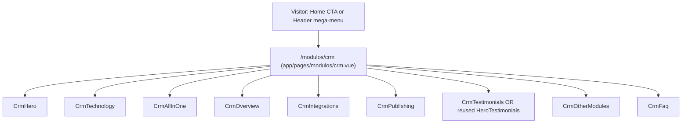

# CRM Imobiliário (`/modulos/crm`) Design

**Spec**: `.specs/features/crm-imobiliario/spec.md`
**Status**: Draft

---

## Architecture Approaches Considered

| # | Approach | Trade-off | Verdict |
| - | -------- | --------- | ------- |
| 1 | **Dedicated static page** — `app/pages/modulos/crm.vue` composes 9 new/reused section components (`Crm*.vue`), each self-contained with inline hardcoded content, exactly mirroring `app/pages/index.vue` | None of note — this is the project's only existing page pattern | **Recommended** |
| 2 | Generic dynamic module page (`app/pages/modulos/[slug].vue`) driven by per-module data objects, sections parameterized by props | Contradicts [[AD-001]] (hardcoded per-page content) and [[AD-003]] (per-page manifest); only 1 of 6 module pages is in scope today (the other 5 are explicitly Out of Scope in `spec.md`) and their Figma layouts likely differ structurally, not just in copy — building the abstraction now is speculative generalization for pages that don't exist yet | Rejected |
| 3 | Reuse existing `Hero*` Home components by adding props/variants for CRM content instead of new `Crm*` components | Risks regressing the already-shipped Home page for the sake of a second consumer; conflicts with the spec's own confirmed assumption (Crm-prefixed clones) and [[AD-004]]'s collision-avoidance rationale | Rejected |

**Decision**: Approach 1. This isn't a new architectural call — it's what the spec's own "Assumptions & Open Questions" table already confirmed (route, hardcoded content, `Crm` prefix, per-page manifest). Recorded here for traceability, not re-litigated.



---

## Code Reuse Analysis

### Existing Components to Leverage

| Component | Location | How to Use |
| --- | --- | --- |
| `CtaButton.vue` | `app/components/ui/CtaButton.vue` | All CTAs across the 9 sections (`primary`/`outline` variants already cover the Figma buttons seen: "Testar grátis", "Agendar Demonstração", "Explorar", etc.) |
| `SectionTag.vue` | `app/components/ui/SectionTag.vue` | The small "Especialidade · X" eyebrow label pattern, used in every existing Hero section header |
| `SectionDivider.vue` | `app/components/ui/SectionDivider.vue` | Between sections, matching Home's spacing convention (used after most, not all, Home sections — follow the same per-section judgment) |
| `FeatureList.vue` | `app/components/ui/FeatureList.vue` | Bullet-style feature lists inside cards (already used by `HeroCrm.vue` for its 4 cards; likely reusable for All-in-One / Overview cards) |
| `NuxtImg` (`@nuxt/image`) | global | All raster images (dashboard mockup, phone mockups, testimonial logos), per project convention — see `nuxt.config.ts` `image` block for configured formats/breakpoints |
| `<details>/<summary>` accordion pattern | `app/components/sections/HeroFaq.vue:134-179` | FAQ accordion — copy the exact markup + scoped `<style>` (chevron rotation) rather than re-deriving it, per AC "WHILE FAQ item open THE system SHALL indicate expanded state" |
| `HeroTestimonials.vue` | `app/components/sections/HeroTestimonials.vue` | Reused as-is **only if** the CRM page's extracted testimonial content matches it exactly (heading already matches); otherwise cloned as `CrmTestimonials.vue`. Decision is objective and deferred to the Testimonials task, per the spec's own resolved assumption — not a Design-time choice. |

### Integration Points

| System | Integration Method |
| --- | --- |
| `HeroCrm.vue` (Home) | Already links to `/modulos/crm` via `CtaButton` — no change needed (confirmed Out of Scope). |
| `HeaderBar.vue` mega-menu | One-line change: the "CRM Imobiliário" item's `to: '/modulos'` (line ~24-25 in the `modulosColumns` data, first item of the "CRM PARA IMOBILIÁRIAS" column) becomes `to: '/modulos/crm'`. The other 3 sibling items in that column stay pointing at `/modulos` (their own pages are Out of Scope). |
| Sibling module routes (`/modulos/sgl`, `/modulos/apis-hub-integrador`, etc.) | Real `href`/`to` values only — those pages don't exist yet and will 404 until built in future features (explicit, intentional per spec Edge Cases). |
| Figma → content pipeline | Same process already validated for Home: MCP Figma read → `FIGMA_CONTENT_MANIFEST_CRM.md` (verbatim copy + asset table) → assets saved to `public/images/<section>/` and `public/icons/` → components written from the manifest, never from memory of the design. |

---

## Components

All 9 are Vue 3 `<script setup>` SFCs with **no props** — content is a local `const` literal in the component itself, identical in shape to every existing `Hero*.vue` section. None expose a public interface beyond the default slot-less template; that's why "Interfaces" below says "none" throughout — this is the established pattern, not an omission.

### `app/pages/modulos/crm.vue`
- **Purpose**: Route entry point; composes the 9 sections in Figma order and sets SEO meta (`useSeoMeta`, mirroring `index.vue`).
- **Location**: `app/pages/modulos/crm.vue`
- **Interfaces**: none (page component)
- **Dependencies**: the 9 section components below
- **Reuses**: `index.vue`'s `useSeoMeta` + `<main>` wrapper pattern

### `CrmHero.vue` — node `3089:12037`
- **Purpose**: Hero/top section — headline, supporting copy, primary CTAs.
- **Location**: `app/components/sections/CrmHero.vue`
- **Interfaces**: none
- **Dependencies**: `CtaButton`
- **Reuses**: `HeroMain.vue` structural pattern (hero layout with CTAs)

### `CrmTechnology.vue` — node `3089:12139`
- **Purpose**: Technology section — static dashboard mockup image + "Agendar Demonstração" CTA.
- **Location**: `app/components/sections/CrmTechnology.vue`
- **Interfaces**: none
- **Dependencies**: `NuxtImg`, `CtaButton`
- **Reuses**: none directly; dashboard mockup is a single static export per the spec's confirmed assumption (not live markup)

### `CrmAllInOne.vue` — node `3089:12611`
- **Purpose**: "All-in-one" section — 4 feature cards (Automação de Marketing, Agenda, Distribuição de Leads, Relatórios e metas) + CTA.
- **Location**: `app/components/sections/CrmAllInOne.vue`
- **Interfaces**: none
- **Dependencies**: `FeatureList` (if cards contain bullet lists) or plain markup, `CtaButton`
- **Reuses**: `HeroCrm.vue:1-119` card-grid pattern (icon + title + list, responsive grid)

### `CrmOverview.vue` — node `3089:12661`
- **Purpose**: "Publicação Integrada de Imóveis" — 3 cards.
- **Location**: `app/components/sections/CrmOverview.vue`
- **Interfaces**: none
- **Dependencies**: none beyond base UI
- **Reuses**: same card-grid pattern as above

### `CrmIntegrations.vue` — node `3089:12689`
- **Purpose**: Integration icons (WhatsApp, redes sociais, RD Station) + CTA/link.
- **Location**: `app/components/sections/CrmIntegrations.vue`
- **Interfaces**: none
- **Dependencies**: none beyond base UI
- **Reuses**: `HeroIntegrations.vue` layout pattern (icon row/grid)

### `CrmPublishing.vue` — node `3089:12721`
- **Purpose**: 4 side-by-side phone/app mockups.
- **Location**: `app/components/sections/CrmPublishing.vue`
- **Interfaces**: none
- **Dependencies**: `NuxtImg`
- **Reuses**: phone-mockup pattern already used elsewhere in the site (per spec assumption — same static-image approach, not live UI recreation)

### `CrmTestimonials.vue` (conditional) — node `3089:12855`
- **Purpose**: Client testimonials/logos.
- **Location**: `app/components/sections/CrmTestimonials.vue` — **only created if** extracted content differs from `HeroTestimonials.vue`; otherwise the page imports `HeroTestimonials` directly and this file is never created.
- **Interfaces**: none
- **Dependencies**: none beyond base UI
- **Reuses**: `HeroTestimonials.vue:1-104` in full (structure + scoped decorative SVGs) if cloned

### `CrmOtherModules.vue` — node `3089:12874`
- **Purpose**: 3 cards linking to sibling `/modulos/<slug>` routes, each with an "Explorar" CTA.
- **Location**: `app/components/sections/CrmOtherModules.vue`
- **Interfaces**: none
- **Dependencies**: `NuxtLink` (via `to`)
- **Reuses**: `HeroOtherProducts.vue:1-109` card pattern (local typed array + `v-for`, `component :is` only needed if any link is external — likely not, since sibling modules are internal routes)

### `CrmFaq.vue` — node `3089:12879`
- **Purpose**: FAQ accordion.
- **Location**: `app/components/sections/CrmFaq.vue`
- **Interfaces**: none
- **Dependencies**: none beyond base UI
- **Reuses**: `HeroFaq.vue:1-179` accordion markup + scoped `<style>` verbatim (native `<details>/<summary>`, chevron rotation via `details[open]`)

---

## Data Models (local content shapes, not persisted)

None of this is stored or fetched — it's the shape of each section's local `const` literal, to keep implementation consistent with existing sections (e.g. `HeroOtherProducts.vue`'s local `Product` interface). Exact field values come from `FIGMA_CONTENT_MANIFEST_CRM.md`, extracted before these are written.

```typescript
// CrmAllInOne.vue / CrmOverview.vue — card shape (mirrors HeroCrm.vue's inline card literal)
interface FeatureCard {
  icon: string        // public/icons/... path
  title: string
  items?: string[]     // bullet list, when the card has one (FeatureList)
  description?: string // plain paragraph, when the card doesn't
}

// CrmOtherModules.vue — mirrors HeroOtherProducts.vue's `Product` interface
interface OtherModuleCard {
  icon: string
  iconWidth: number
  iconHeight: number
  title: string
  description: string
  href: string // real internal route, e.g. '/modulos/sgl'
}

// CrmFaq.vue — mirrors HeroFaq.vue's inline `faqs` shape
interface FaqItem {
  question: string
  answer: string
}
```

**Relationships**: none — each array is local to its own component, no cross-component or persisted state.

---

## Error Handling Strategy

| Error Scenario | Handling | User Impact |
| --- | --- | --- |
| Sibling module route not yet built (`/modulos/sgl`, etc.) | None needed — intentional per spec Edge Cases; Nuxt's default 404 page handles it | Visitor sees the site's standard 404 until that page ships in a future feature |
| Image/icon asset fails to load | None beyond standard `alt` text (accessibility fallback); no retry/placeholder logic — same as every existing section on the site | Broken-image icon in browser; caught by the QA/audit task, not runtime code |

---

## Risks & Concerns

| Concern | Location (file:line) | Impact | Mitigation |
| --- | --- | --- | --- |
| Figma content for `/modulos/crm` has not been extracted yet — no `FIGMA_CONTENT_MANIFEST_CRM.md` exists | n/a (file doesn't exist) | Writing component copy from memory/assumption instead of the Figma source would violate the spec's "no invented text" goal | First task in Tasks phase must be content+asset extraction into `FIGMA_CONTENT_MANIFEST_CRM.md`, before any `Crm*.vue` is written — same order already validated for Home |
| Testimonials reuse-vs-clone branch depends on content not yet extracted | `app/components/sections/HeroTestimonials.vue` | Design can't pre-decide this without inventing Figma content | Deferred to its own task with the objective comparison criterion already defined in `spec.md`'s Assumptions table |
| No automated test runner ([[AD-002]]) | n/a | Task gates can't be "tests pass" in the literal sense | Task gate = `npm run build` succeeding + manual verification of each task's mapped acceptance criteria (documented per task in `tasks.md`) |
| Project has no git repository yet (`.specs/STATE.md` Handoff) | n/a | Execute's "one atomic commit per task" contract has nothing to commit to | User explicitly deferred `git init` (2026-09-08); Execute will proceed without commits and the Verifier will record this as a documented deviation, not a silent skip |
| `HeaderBar.vue`'s `modulosColumns` array has 3 other items also pointing at the placeholder `to: '/modulos'` | `app/components/layout/HeaderBar.vue:24-45` | Easy to accidentally change more than the one confirmed line | Task for this step touches only the "CRM Imobiliário" item's `to` value; the other 3 stay `/modulos` (explicitly Out of Scope) |

> All identified concerns have a mitigation above; none are blocking Design approval.

---

## Tech Decisions (feature-local only)

| Decision | Choice | Rationale |
| --- | --- | --- |
| Route file | `app/pages/modulos/crm.vue` | Nuxt file-based routing; matches the `/modulos/<slug>` shape already referenced as real hrefs elsewhere in the codebase |
| Section anchor IDs | kebab-case, content-based (e.g. `id="crm-tecnologia"`, `id="crm-duvidas-frequentes"`) | Matches existing convention (`id="crm-imobiliario"`, `id="depoimentos"`, `id="duvidas-frequentes"` in Home sections); exact slugs finalized per section once Portuguese copy is extracted |
| Dashboard/phone mockups | Static `NuxtImg` exports, not live HTML/CSS recreation | Already confirmed in spec's Assumptions table; consistent with existing phone-mockup sections elsewhere on the site |

No new project-level decisions surfaced during Design — [[AD-001]] through [[AD-004]] already cover every cross-cutting choice this feature needed.

---

## Requirement Traceability (Design pass)

Updates `spec.md`'s traceability table `Phase` column from `Pending` to `In Design` conceptually; the actual per-row status flip happens in `spec.md` once Tasks maps each `CRM-NN` to a task ID (per the skill's Status lifecycle: Pending → In Design → In Tasks → Implementing → Verified). No requirement IDs are dropped or reinterpreted here — all 14 map cleanly to the 9 components + 1 header-link change above.
