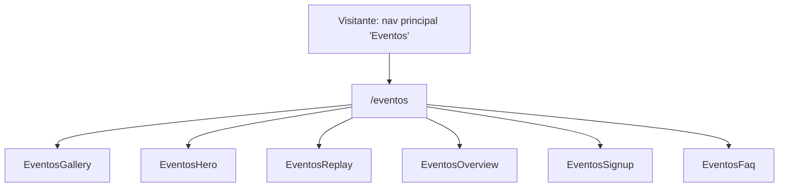

# Eventos (`/eventos`) Design

**Spec**: `.specs/features/eventos/spec.md`
**Status**: Draft

---

## Architecture Approaches Considered

| # | Approach | Trade-off | Verdict |
| - | -------- | --------- | ------- |
| 1 | **Dedicated static page** — `app/pages/eventos.vue` compõe 6 seções (`Eventos*.vue`), reaproveitando `layout/Faq.vue` (via um wrapper fino `EventosFaq.vue`, mesmo padrão de `CrmFaq.vue`/`BaseConhecimentoFaq.vue`) e construindo bespoke onde não há shell genérico compatível (Gallery, Hero, Replay, Overview, Signup) | Nenhum de nota — é o padrão já validado nas features anteriores de página | **Recomendado** |
| 2 | Reaproveitar `layout/Hero.vue` para `EventosHero.vue` | `layout/Hero.vue` assume uma composição foto+cards+badge de canto com layout de aspect-ratio fixo e fileira de ícones de módulo — nenhuma dessas peças existe no Hero de Eventos (que tem H1+descrição centralizados e depois um bloco "Próximo evento" com imagem+texto+CTA lado a lado). Forçar o encaixe exigiria tantos overrides de prop que o shell deixaria de simplificar algo | Rejeitado — `EventosHero.vue` bespoke |
| 3 | Reaproveitar `layout/Portfolio.vue` para `EventosReplay.vue` (já que ambos têm heading+lead+CTA) | `Portfolio.vue` é estruturalmente 1 imagem + 1 coluna de texto/features — a seção Replay é um heading centralizado seguido de uma fileira de **3 cards iguais** (thumbnail+tag+título+play), não uma imagem única com lista de features. O formato de card (thumbnail/tag/play) também não tem nada em comum com `PortfolioFeature` (ícone pequeno+título+descrição) | Rejeitado — `EventosReplay.vue` bespoke, seguindo o mesmo padrão já estabelecido de gradiente inlined por seção (`CrmPortfolio.vue`, `CrmUrbanoLeadsChart.vue`, `SiteLoteadorasSglOffer.vue`) |

**Decisão**: Approach 1. Reflete as decisões já confirmadas no `spec.md` (Assumptions & Open Questions).



---

## Code Reuse Analysis

Pesquisa feita por um sub-agente Explore dedicado, cobrindo todo `app/components/` — resumo:

### Existing Components to Leverage

| Component | Location | How to Use |
| --- | --- | --- |
| `sections/CrmFaq.vue` (referência de padrão) → `layout/Faq.vue` | `app/components/sections/CrmFaq.vue`, `app/components/layout/Faq.vue` | Base do `EventosFaq.vue` — wrapper fino idêntico a `CrmFaq.vue`/`BaseConhecimentoFaq.vue`: `sectionId`, `faqs` array local (`{question, answer}[]`), `plusIconSrc`/`minusIconSrc` já existentes |
| `/icons/faq-plus-circle.svg` / `faq-minus-circle.svg` | `public/icons/` | Ícones do accordion FAQ, reaproveitados sem alteração |
| `ui/CtaButton.vue` | `app/components/ui/CtaButton.vue` | CTA "Ver mais vídeos no App SUBSEE" (variant `outline` ou `primary` conforme cor de fundo do painel) — usar `to="https://app.subsee.com.br/..."` + atributos `target="_blank"` `rel="noopener"` passados como fallthrough (Vue encaminha atributos não declarados como prop para o elemento raiz renderizado, incluindo quando o componente renderiza um `NuxtLink`) |

### Não existe (confirmado pela pesquisa) — construir bespoke

| Necessidade | Por quê não há reuso | Onde vai |
| --- | --- | --- |
| Fileira de N cards com thumbnail + ícone de play + tag colorida + título | Nenhum componente no site (Home, CRM, APIs, `/modulos/*`) implementa esse formato. `layout/Testimonials.vue` (cards de depoimento) e `layout/Portfolio.vue` (imagem+features) têm formatos de card completamente diferentes | `EventosReplay.vue` |
| Painel com fundo em gradiente suave | Não existe um shell `layout/` genérico para isso — todo lugar no site que usa gradiente o faz inline no próprio template da seção (`CrmPortfolio.vue`, `CrmUrbanoLeadsChart.vue`, `SiteLoteadorasSglOffer.vue`) | Gradiente inlined direto em `EventosReplay.vue`, mesmo padrão |
| Card inteiro clicável (badge+H2+descrição+CTA+imagem, o card todo é um link) | Não existe — `HeroBlog.vue` tem cards como `<article>` com apenas um link de texto interno, não o card todo | `EventosSignup.vue` |
| Duas colunas: texto à esquerda / imagem à direita com blocos decorativos sólidos atrás + ícone de play decorativo | Não existe como padrão reutilizável. O idioma mais próximo (forma decorativa atrás de uma imagem) é `HeroCrm.vue`, mas lá é um blur radial dentro de um Hero, não uma seção "Overview" de duas colunas, e não há ícone de play em lugar nenhum do site hoje | `EventosOverview.vue` |
| Fileira decorativa de 5 fotos no topo da página | Não existe | `EventosGallery.vue` |

### Não criar (decisão explícita)

- **Nenhum novo átomo em `ui/`** para "Badge"/"Tag"/"PlayButton" — `ui/SectionTag.vue` existe mas é um kicker ponto+texto, visualmente diferente das 2 necessidades desta página (chip "EVENTO ONLINE" no Signup, tags coloridas "LIVE"/"VERSÃO ATUAL"/"NOVOS TREINAMENTOS" no Replay). Cada uma aparece **uma vez** (o chip) ou dentro de um array já local ao próprio `EventosReplay.vue` (as tags) — não há uma segunda página consumidora hoje. Markup local nas seções bespoke, seguindo a regra do CLAUDE.md "não criar uma abstração para um caso único".
- **Nenhum `app/data/eventos.json`** — os 3 cards de Replay e as 6 perguntas de FAQ são conteúdo pequeno e de página única; CLAUDE.md já orienta: "a 4-item feature list, a 5-card grid doesn't need its own JSON file — a typed const array... is enough". Mesma escolha que `CrmFaq.vue` já faz (array de FAQ hardcoded inline, não em JSON).

### Integration Points

| System | Integration Method |
| --- | --- |
| `HeaderBar.vue` nav principal | Já linka para `/eventos` (`navItems`, linha 8) — confirmado, sem alteração necessária. |
| `app/app.vue` | Já monta `<TheHeader />`/`<TheFooter />` ao redor de `<NuxtPage />` — a página Eventos não deve incluir Header/Footer no próprio template (mesmo padrão de toda página existente). |
| Figma → content pipeline | `get_design_context`/`get_metadata` node a node → `FIGMA_CONTENT_MANIFEST_EVENTOS.md` (já escrito) → 2 assets de imagem já existentes e confirmados em `public/images/eventos/` (`banner-eventos.png`, `eventos_vivo.png`) + demais assets pendentes de export → componentes escritos a partir do manifesto. |

---

## Components

Todas as 6 seções são Vue 3 `<script setup>` SFCs, prefixo `Eventos`. `EventosFaq.vue` segue o padrão thin-wrapper já estabelecido; as demais são bespoke (hardcoded-sem-props), mesmo padrão de `CrmAllInOne.vue`/`ApisConecte.vue`.

### `app/pages/eventos.vue`
- **Purpose**: Route entry point; compõe as 6 seções na ordem do Figma, `useSeoMeta`.
- **Reuses**: padrão de `app/pages/modulos/apis-hub-integrador.vue` (mesmo formato `<main>` + `useSeoMeta`), mas fora de `modulos/` (rota é `/eventos`, não `/modulos/eventos`).

### `EventosGallery.vue` — node `3171:42079`
- **Purpose**: Fileira decorativa de 5 fotos no topo da página, sem texto.
- **Dependencies**: 5 fotos (pendentes de export).
- **Estrutura de dados**: array local `{ src: string; alt: string }[]` de 5 itens, um `v-for` sobre um único template de foto (CLAUDE.md: conteúdo repetitivo vira array tipado).

### `EventosHero.vue` — node `3171:41850`
- **Purpose**: H1 + descrição (centralizados) + divisor decorativo + bloco "Próximo evento" (imagem `banner-eventos.png` + kicker + parágrafo de destaque + CTA).
- **Dependencies**: `banner-eventos.png` (já existe), 2 formas decorativas "icone-shape" (pendentes), ícone de divisor horizontal (verificar se `/icons/crm-hero-divider-onda.svg` já reaproveitável ou se precisa de export próprio — mesma forma de onda já vista em Heroes anteriores).
- **Sem props** — conteúdo hardcoded, CTA com `href="#"` documentado como pendente (ver spec Assumptions).

### `EventosReplay.vue` — node `3171:41881`
- **Purpose**: Heading centralizado + fileira de 3 cards de vídeo/replay + CTA externo, dentro de um painel com gradiente.
- **Dependencies**: 3 thumbnails + ícones de play/triângulo (pendentes de export), `ui/CtaButton.vue`.
- **Estrutura de dados**: array local `ReplayCard[]` com shape `{ thumbnail: string; tag: string; title: string; overlayCaption?: string; versionBadge?: string }` — os campos opcionais cobrem as variações reais entre os 3 cards (card 1 tem legenda sobre a miniatura, card 2 tem selo de versão, card 3 não tem nenhum extra) sem inventar uma uniformidade que o Figma não tem.

### `EventosOverview.vue` — node `3171:41921`
- **Purpose**: Duas colunas — texto (H2+descrição) à esquerda, imagem+blocos decorativos+play decorativo à direita.
- **Dependencies**: foto principal + ícone de play + 2 círculos decorativos (pendentes de export).
- **Sem CTA** (confirmado no manifesto). Ícone de play puramente decorativo — não deve virar um `<a>`/embed de vídeo real.

### `EventosSignup.vue` — node `3171:42068`
- **Purpose**: Card inteiro clicável — badge, H2, descrição, CTA estilizado, nota, imagem `eventos_vivo.png`.
- **Dependencies**: `eventos_vivo.png` (já existe).
- **`href="#"` documentado como pendente** (ver spec Assumptions) — o card inteiro é um `<a>`/`<NuxtLink>` envolvendo todo o conteúdo, replicando a estrutura do Figma (não apenas o texto "Inscreva-se!!!").

### `EventosFaq.vue` — node `3171:41947` (conteúdo em `3183:3037`)
- **Purpose**: Accordion de 6 perguntas/respostas.
- **Dependencies**: `sections/CrmFaq.vue` como referência de wrapper (mesmo shape de props), `layout/Faq.vue`, ícones "+"/"−" já existentes.
- **Nota**: pergunta 6 mantém a resposta duplicada exatamente como no Figma (ver spec Assumptions) — não corrigir silenciosamente.

---

## Data Models (local content shapes, not persisted)

```typescript
// EventosGallery.vue
interface GalleryPhoto { src: string; alt: string }

// EventosReplay.vue
interface ReplayCard {
  thumbnail: string
  tag: string
  tagColor?: string
  title: string
  overlayCaption?: string   // apenas o card 1 ("SVN Investimentos SUB100 Sistemas")
  versionBadge?: string     // apenas o card 2 ("1.0.18")
}

// EventosFaq.vue — mirrors CrmFaq.vue's `faqs` shape
interface FaqItem { question: string; answer: string }
```

**Relationships**: nenhuma — cada array é local ao seu componente. Nenhum dado compartilhado com outras páginas (diferente de `testimonials.json`, que não é usado nesta feature).

---

## Error Handling Strategy

| Error Scenario | Handling | User Impact |
| --- | --- | --- |
| Destino do CTA "Inscreva-se!!!" ainda não confirmado no momento da implementação | `href="#"` documentado no código nas 2 ocorrências (Hero e Signup) | Link não navega para lugar nenhum até ser corrigido numa iteração futura — comportamento intencional e documentado, não um bug silencioso |
| Resposta duplicada da pergunta 6 do FAQ | Reproduzir o Figma tal como está, documentado como problema conhecido do arquivo de origem | Conteúdo visivelmente repetitivo para o usuário final até uma decisão de conteúdo ser tomada — fora do controle desta feature de portar o layout |
| Imagem/ícone não carrega | `alt` text padrão, sem retry/placeholder — mesmo padrão do resto do site | Ícone quebrado no navegador; coberto pela auditoria de QA final |

---

## Risks & Concerns

| Concern | Location | Impact | Mitigation |
| --- | --- | --- | --- |
| Data do "próximo evento" (29 OUT 2026) fixa dentro de `banner-eventos.png` | `EventosHero.vue` | Se o evento anunciado mudar, a imagem inteira precisa ser re-exportada do Figma — não é editável via texto/CSS | Documentado como trade-off aceito da decisão de usar imagem única (mesmo padrão já usado para composições complexas no site) |
| Quantidade grande de assets pendentes de export (5 fotos + 3 thumbnails + ~5 ícones/decorações) | T2 da fase Tasks | Risco de timing — URLs de asset do Figma expiram em ~7 dias | Mesma mitigação já aplicada em `base-de-conhecimento`: baixar tudo logo no início do Execute |
| 2 CTAs "Inscreva-se!!!" sem destino confirmado | `EventosHero.vue`, `EventosSignup.vue` | Página fica com 2 links mortos até confirmação | Documentado explicitamente no spec como Open Question — não é um "quase certo" silencioso |
| Nenhum test runner ([[AD-002]]) | n/a | Gate de task não pode ser "testes passam" literalmente | Gate = `pnpm build` + verificação manual/visual por critério de aceite |

> Todos os riscos identificados têm mitigação acima; nenhum bloqueia a aprovação do Design.

---

## Tech Decisions (feature-local only)

| Decision | Choice | Rationale |
| --- | --- | --- |
| Route file | `app/pages/eventos.vue` (não `app/pages/modulos/eventos.vue`) | A rota confirmada é `/eventos`, item de nav de topo, não um módulo — segue a estrutura de arquivos do Nuxt (roteamento por caminho de arquivo) |
| Prefixo dos componentes | `Eventos` | Sem colisão, segue [[AD-004]] |
| Section anchor IDs | kebab-case, baseado em conteúdo (ex.: `id="eventos-hero"`, `id="eventos-replay"`, `id="eventos-visao-geral"`, `id="eventos-inscricao"`, `id="eventos-duvidas-frequentes"`) | Mesmo padrão já usado em todas as páginas de módulo |
| CTA externo do Replay via `CtaButton` + atributos fallthrough (`target`/`rel`) | Confirmado adequado | `CtaButton.vue` não usa `inheritAttrs: false` nem declara `target`/`rel` como prop — atributos não declarados são encaminhados automaticamente pelo Vue para o elemento raiz renderizado (o `NuxtLink`/`<a>`), preservando o componente compartilhado em vez de duplicar sua marcação |

Nenhuma decisão de projeto nova surgiu durante o Design que exija um novo `AD-NNN` em `STATE.md` — [[AD-001]] a [[AD-016]] já cobrem as escolhas cross-cutting necessárias.

---

## Requirement Traceability (Design pass)

Reflete conceitualmente a coluna `Phase` do `spec.md` de `Pending` para `In Design`. Os 12 `EV-NN` mapeiam para as 6 seções + 1 task de manifesto (já concluída nesta sessão) + 1 task de QA responsiva/SEO, a formalizar em `tasks.md` na Etapa 2 (Tasks), ainda não executada — aguardando aprovação do usuário para esta Etapa 1 (Specify + Design).
