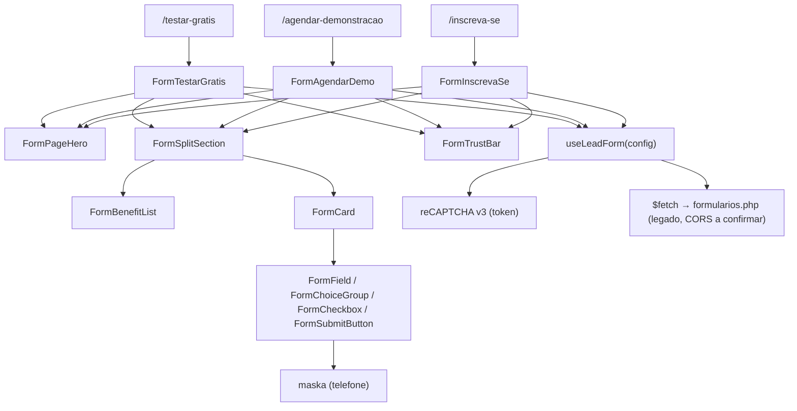

# Formulários Design

**Spec**: `.specs/features/formularios/spec.md`
**Manifesto Figma**: `FIGMA_CONTENT_MANIFEST_FORMULARIOS.md`
**Status**: Etapa 1 fechada com as decisões D1–D16 do `spec.md` — aguardando aprovação para a Etapa 2

---

## Architecture Approaches Considered

| # | Approach | Trade-off | Verdict |
| - | -------- | --------- | ------- |
| 1 | **Shell compartilhado + configuração por dados**: 3 páginas finas (`pages/`) → 3 wrappers de `sections/` que só fornecem config (textos, benefícios, campos, CTA, tipo de envio) → shells em `layout/` e campos em `ui/`; lógica em um composable `useLeadForm` | Exige um contrato de config bem tipado; ganha um único lugar para validação/envio e três páginas que diferem só por dados | **Recomendado** |
| 2 | Uma única `FormPage` dirigida por rota dinâmica (`/formularios/[slug]`) | As rotas decididas são distintas e já referenciadas por CTAs (`/testar-gratis`, `/agendar-demonstracao`, `/inscreva-se`); um slug dinâmico as quebraria e perderia `useSeoMeta` explícito por página | Rejeitado |
| 3 | Três páginas independentes com markup copiado | ~90% do markup e toda a lógica seriam idênticos; viola a componentização (CLAUDE.md) | Rejeitado |
| 4 | Reaproveitar `layout/Hero.vue` para o topo | `Hero.vue` é composição foto+cards+badge com aspect-ratio fixo; o topo destes formulários é H1+descrição centralizados sobre um fundo/divisor — nenhuma peça em comum | Rejeitado (`FormPageHero` novo em `layout/`) |

**Decisão**: Approach 1. O Figma valida a estrutura: as três páginas têm a mesma árvore (`Background → Hero/Top → Hero/Form → Hero/Credibility`) e diferem por texto, ícones da lista e presença do textarea — diferenças de dados, não de estrutura. As diferenças que **são** estruturais (textarea só em 2 de 3; badge fora do `List` em Inscreva-se; ícone do card como asset único vs. círculo CSS + ícone) entram como props/slots, não como fork.



---

## Estrutura de componentes proposta

Regra: prefixo `Form*` em **todos** os componentes desta feature ([[AD-004]], [[AD-010]]). Nomes finais serão confirmados na Etapa 2 com `grep` de colisão (hoje `grep -ri "Form" app/components` não encontra componentes próprios).

### `layout/` — shells sem conteúdo (classes por prop via `withDefaults`, HTML rico por slot)

| Componente | Responsabilidade | Props / slots |
| --- | --- | --- |
| `FormPageHero` | Fundo + divisor horizontal + coluna centralizada de 820px com H1 e descrição | slots `#heading`, `#lead`; props de classe |
| `FormSplitSection` | Coluna de texto (530px) + card (640px), `px-[305px]` do Figma traduzido para `container-page`; empilha abaixo de `tablet-lg` | slots `#intro` (título/descrição/lista), `#card` |
| `FormBenefitList` | Lista de benefícios com chip 60px + título + descrição | prop `items: FormBenefit[]`, slot `#footer` (badge, para Inscreva-se fora do `List` vs. dentro) |
| `FormCard` | Casca do card (sombra, radius, padding) + header (ícone, título, subtítulo) | slots `#icon`, `#title`, `#subtitle`, default (campos) |
| `FormTrustBar` | Barra de credibilidade | prop `items: FormTrustItem[]` |

### `ui/` — primitivos sem dados de negócio

| Componente | Responsabilidade |
| --- | --- |
| `FormField` | Label + `input`/`textarea`/`select` + mensagem de erro; `v-model` via `defineModel`; suporta `mask` (função) e `required` |
| `FormChoiceGroup` | Chips com ícone; modo `single`/`multiple`; `v-model`. **Suporte e Treinamento** = 3 checkboxes independentes (`multiple`, D8) — semanticamente `<input type="checkbox">` em um `<fieldset>`/`<legend>`, estilizados como chips. **Área de atuação** = seleção única no Figma (`single`), mapeamento para o payload em aberto (Q7) |
| `FormCheckbox` | Checkbox de aceite com slot para o texto (links para `/lgpd/termos-de-uso/` e `/lgpd/politica-de-privacidade/`, D7) |
| `FormSubmitButton` | CTA de gradiente com seta e estado `loading`; texto por slot (a tipografia diferente entre as páginas — Q22 — entra por prop de classe) |

Reaproveitar sem alteração: `CtaButton` (só se o gradiente do CTA não exigir um botão próprio — o CTA do Figma é `<button type="submit">` e não um link), `SectionDivider`, ícones `Icon*` (`IconArrowRight`, `IconChevronDown`, `IconCheck`, `IconUser`) quando equivalentes exatos ao Figma; caso contrário, novos SVGs em `public/icons/`, um por ícone, sem duplicar por página.

### `sections/` — conteúdo e configuração por página

| Componente | Faz |
| --- | --- |
| `FormTestarGratis` | Config P1 (`/testar-gratis`): H1/descrição, título+descrição+3 benefícios (calendar/settings/headphones), card (rocket, "Comece seu teste grátis"), CTA, **sem** textarea; `tipoMail`/`formSite` pendentes (Q4/Q5), regra de backend pendente (Q25) |
| `FormAgendarDemo` | Config P2 (`/agendar-demonstracao`): idem com monitor/settings/user, message-circle, textarea "Informe o melhor dia e horário…"; obrigatoriedade da mensagem pendente (Q10) |
| `FormInscrevaSe` | Config P3 (`/inscreva-se`): idem, textarea **opcional** "(opcional)", badge fora da lista, texto do CTA; identificação do envio pendente (Q4/Q5/Q19/Q26) |

Cada wrapper compõe os mesmos shells e passa `FormPageConfig`. Conteúdo repetido nas três (trust bar, badge, campos comuns, chips de contato e de área de atuação, texto do checkbox, lista de UFs) fica **uma vez** em `app/data/forms.ts` (compartilhado entre páginas → justifica arquivo de dados; TS permite tipar) e é importado na camada `sections/`, nunca em `layout/` ([[CLAUDE.md#JSON data]]).

### Lógica (Composition API + TypeScript)

- `app/composables/useLeadForm.ts` — estado reativo, validação por campo, montagem do payload, envio via `$fetch`, leitura de `__trf.src` com `useCookie` → `traffic_source`, obtenção do token reCAPTCHA v3, disparo do evento `obrigado` (só após sucesso; alvo em Q16).
- Máscara de telefone: diretiva `vMaska` da `maska` (D11), aplicada em `FormField` via prop `mask`. Instalação **somente na Etapa 2**; sem `app/utils/masks.ts`.
- `app/types/forms.ts` — contratos abaixo.
- `nuxt.config.ts` — `runtimeConfig.public.formsEndpoint` (valor: endpoint legado, D15) e `runtimeConfig.public.recaptchaSiteKey` (**valor vazio até Q13**; nunca inventar). Nenhuma outra alteração além do necessário.
- `app/pages/` — 3 arquivos finos: `testar-gratis.vue`, `agendar-demonstracao.vue`, `inscreva-se.vue`, cada um com `useSeoMeta` + `<main>` que compõe o wrapper `sections/` (segue `eventos.vue`).

### Máquina de estados do envio (D13, D14)

Dois eixos independentes, nunca misturados:

| Eixo | Estados | Regra |
| --- | --- | --- |
| Validação de campo | `errors: Partial<Record<FormFieldKey \| 'contactPreference' \| 'area' \| 'accepted', string>>` | Preenchido ao submeter (e re-validado por campo após a primeira tentativa). Bloqueia o envio; **não** altera `status` |
| Envio | `status: 'idle' \| 'submitting' \| 'success' \| 'failure'` + `submitError` | `submitting` → `success` **somente** se o `$fetch` resolver com sucesso; qualquer rejeição (rede, CORS, HTTP de erro, token reCAPTCHA indisponível) → `failure` com dados preservados e botão reabilitado |

Isto corrige o defeito do legado (sucesso marcado mesmo com POST falho). A resposta do PHP legado pode devolver HTTP 200 com corpo de erro; o critério de "sucesso" precisa do contrato real (Q23/Q6) — até lá, o composable concentra o critério em **um** ponto (`isSuccessResponse`) para ajuste único.

O estado de sucesso é **inline** (a seção do card troca o formulário por uma mensagem); o visual final não é inventado e fica atrás de um slot/estilo mínimo neutro até a resposta do Figma (Q15).

### reCAPTCHA v3

- Carregamento sob demanda no cliente (`useHead` com script, ou carregado no primeiro foco do formulário) para não impactar PageSpeed; sem script no `<head>` global.
- Token obtido via `grecaptcha.execute(siteKey, { action })` no submit e enviado em `token`. `siteKey` vem de `runtimeConfig.public`; `action` e verificação server-side: Q13 (não inventar valores).
- Falha ao obter token = falha de envio (`failure`), não sucesso.

### Rotas e links

| Página | Rota | CTAs existentes |
| --- | --- | --- |
| Testar grátis | `/testar-gratis` | ~35 CTAs (Header, Hero*, Crm*, Apis*, PlanoEPreco*) — já apontam |
| Agendar Demonstração | `/agendar-demonstracao` | `SiteUrbanoListings.vue`, `SiteRuralListings.vue` — foram atualizados para apontar para `/agendar-demonstracao` |
| Inscreva-se | `/inscreva-se` | `EventosSignup.vue`, `EventosHero.vue` (`href="#"`) — precisam ser atualizados na Etapa 2 |
| Termos / Privacidade (checkbox) | `/lgpd/termos-de-uso/`, `/lgpd/politica-de-privacidade/` | Não há páginas em `app/pages` (Q27). Header já usa esses caminhos (sem a barra final na privacidade); Footer usa `/termos-de-uso` e `/politica-de-privacidade` — inconsistência fora do escopo desta feature |

### Contratos (esboço, sem código de produção)

```ts
type FormFieldKey =
  | 'empresa' | 'contato' | 'site' | 'phone' | 'email'
  | 'cidade' | 'estado' | 'message'

type ContactPreference = 'ligacao' | 'email' | 'whatsapp'

interface FormPageConfig {
  tipoMail?: string   // pendente Q4 — sem valor até confirmação do backend
  formSite?: string   // pendente Q5 — idem
  hero: { titlePrefix: string; titleAccent: string; lead: string }
  intro: { title: string; lead: string; benefits: FormBenefit[]; badgeInsideList: boolean }
  card: { icon: string; title: string; subtitle: string; ctaLabel: string }
  message?: { placeholder: string; required?: boolean } // ausente em Testar grátis; Inscreva-se: opcional; Agendar: Q10
}

interface LeadPayload {
  token?: string
  tipo_mail?: string
  formSite?: string
  empresa: string
  contato: string
  site: string
  phone: string
  email: string
  produto?: string    // pendente Q7
  cidade: string
  estado: string
  message?: string
  respostaWhatsapp: boolean
  respostaLigacao: boolean
  respostaEmail: boolean
  aceito: boolean
  traffic_source: string
}
```

`tipo_mail`, `formSite` e `produto` ficam **opcionais no tipo** e sem valor nos dados até o backend responder (D12, D16); `FormPageConfig` não recebe valores default inventados. O envio real só é ligado quando esses campos estiverem confirmados; a UI e a validação não dependem deles.

Mapeamento Figma → payload:

| Figma | Payload | Estado |
| --- | --- | --- |
| Empresa* | `empresa` | Fechado (obrigatório, D9) |
| Nome completo* | `contato` | Fechado |
| Site | `site` | Fechado (opcional) |
| Telefone* (`maska`) | `phone` | Fechado; padrão da máscara: Q12 |
| E-mail* | `email` | Fechado |
| Cidade* / Estado* | `cidade` / `estado` | Fechado; valor de `estado` (sigla?): Q11 |
| Suporte e Treinamento* (3 checkboxes, ≥1) | `respostaLigacao` / `respostaEmail` / `respostaWhatsapp` | Fechado (D8) |
| Área de atuação* (Urbana/Rural/Temporada) | `produto` | **Aberto** — mapeamento e valor esperado: Q7 |
| Checkbox de aceite* | `aceito` | Fechado |
| Mensagem | `message` | Testar grátis: ausente (Q25); Inscreva-se: opcional; Agendar: Q10 |
| (cookie `__trf.src`) | `traffic_source` | Fechado (leitura); origem do cookie: Q17 |
| (reCAPTCHA v3) | `token` | Versão fechada; config: Q13 |

---

## Code Reuse Analysis

| Existente | Local | Uso |
| --- | --- | --- |
| `TheHeader`/`TheFooter` | `app/app.vue` | Já globais; as páginas só compõem `<main>` |
| Padrão de página fina | `app/pages/eventos.vue` | Modelo: `useSeoMeta` + seções |
| `container-page`, `section-py`, breakpoints | `app/assets/css/main.css` | Layout e responsividade |
| `CtaButton`, `SectionTag`, `SectionDivider`, `IconArrowRight`, `IconChevronDown`, `IconCheck` | `app/components/ui`, `icons` | Só se idênticos ao Figma |
| Fundo/divisor horizontal | `public/images/divider/` | Verificar se já cobre "Horizantal Divider" do Figma antes de exportar novos vetores |
| Padrão wrapper com `withDefaults` (ex.: `CrmFaq.vue` → `layout/Faq.vue`) | `sections/` → `layout/` | Modelo para `FormTestarGratis` etc. |

Não existe hoje: qualquer `<form>`, `app/composables/`, `app/utils/`, `server/`, `runtimeConfig`, axios, vue-the-mask, reCAPTCHA. Tudo o que envolve envio é novo.

---

## Tecnologia (verificada em 2026-09-29)

| Item | Estado |
| --- | --- |
| Nuxt | `^4.5.2` |
| Vue | `^3.5.42` (`vue-router ^5.3.0`) |
| TypeScript | Sem dependência explícita; `tsconfig.json` do Nuxt; sem `vue-tsc` no `package.json` |
| Tailwind | v4 via `@tailwindcss/vite` |
| `axios` | Não instalado, não usado → substituir por `$fetch` |
| `vue-the-mask` | Não instalado → substituído por `maska` (D11; v3.2.2, sem peerDependencies; instalar na Etapa 2 e validar SSR do Nuxt 4) |
| reCAPTCHA | v3 decidida (D15); nenhuma integração existente; forma de carregar definida em "reCAPTCHA v3" acima; site key/action: Q13 |
| Solução moderna já disponível | `$fetch`/`useFetch`, `useCookie`, `useRuntimeConfig`, `defineModel`, `useSeoMeta` — sem dependências |

---

## Decisões que precisam de confirmação antes das Tasks

Rotas e comportamento-base já decididos (D4–D15). Restam, sem bloquear a UI: contrato do backend (Q4–Q7, Q25, Q26), reCAPTCHA (Q13), CORS/endpoint (Q6), rotas legais (Q27), evento/Zoom (Q19), Mensagem em Agendar (Q10), visual/texto de sucesso e erro (Q14, Q15), responsivo (Q20). Ver `spec.md`.

Sugestão para a Etapa 2: separar as tasks em (a) UI/validação/estados, sem dependência de backend, e (b) wiring do envio real, bloqueado por Q4–Q7, Q13, Q25, Q26.

## Riscos

1. **CORS/origem do endpoint PHP** e possível exigência de token reCAPTCHA específico; sem o legado, não testável nesta etapa.
2. **Roteamento silencioso de leads** por `tipo_mail`/`formSite` incorretos.
3. **Divergência Figma × legado** (Empresa obrigatória; `produto` sem campo; Testar grátis sem `message` onde o legado exigia — Q25).
4. **Figma só em 1920px e sem estados** — risco de invenção de UI; mitigado registrando cada lacuna como Open Question.
5. **Sitewide**: não usar `translate-x/y` (AD-007) — o Figma usa `-translate` para ícones aninhados; usar flex. Não usar literais de array/objeto em atributos de template (Tailwind v4). Sem comentários no código.
6. **LGPD/privacidade**: cookie de tráfego e consentimento; links legais inconsistentes entre Header e Footer.
7. **Duplicação de conteúdo no Figma** (descrição repetida entre "Acesso completo por 30 dias" e "Demonstração direcionada") — reproduzir e sinalizar.
8. **Defeito herdado do legado** (sucesso mesmo com POST falho): mitigado pela máquina de estados de dois eixos; o critério de sucesso depende do contrato de resposta real (Q23).
9. **Links legais `/lgpd/...` inexistentes no repositório** (Q27): o checkbox pode apontar para 404 até haver página/proxy.
