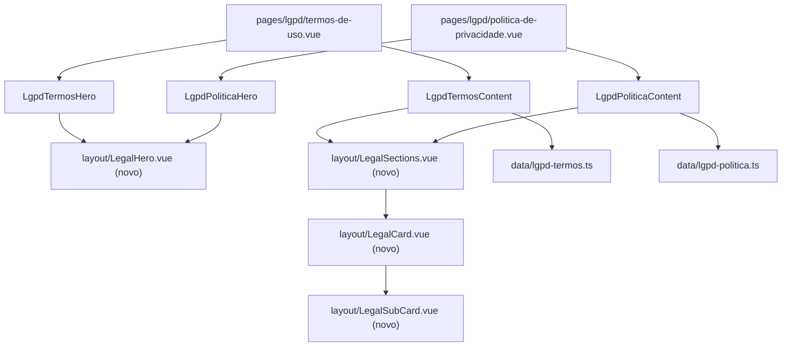

# LGPD: Termos de Uso e Política de Privacidade Design

**Spec**: `.specs/features/lgpd/spec.md`
**Status**: Draft (Etapa 1: análise e planejamento; nenhum código alterado)

---

## Architecture Overview

Duas páginas finas em `app/pages/lgpd/` compõem cada uma um Hero e uma lista de cartões. O que é igual nas duas (Hero, cartão de seção, subcartão, tokens) vira componente compartilhado uma vez; o que muda (texto) vira dado tipado em `app/data/`. Sem backend, sem estado, sem JS além da navegação ([[AD-001]]). Header e Footer são globais e não entram nas páginas.



Fluxo de dados: `sections/Lgpd*Content` importa o array da página, passa para `layout/LegalSections` como prop tipada, e `LegalSections` faz um único `v-for` sobre um único template de `LegalCard`.

---

## Code Reuse Analysis

### Existente que dá para reusar

| Componente / arquivo | Local | Uso |
| --- | --- | --- |
| `HeaderBar` / `TheFooter` | `app/components/layout/` | Globais; só corrigir os links do rodapé (spec, seção Links) |
| Padrão de página fina | `app/pages/planos-e-precos.vue` (em `master`) | `<main>` com sections; `useSeoMeta` só depois da Q5 |
| `container-page`, breakpoints | `app/assets/css/main.css` | Recuo lateral e larguras responsivas |

### Por que o Hero é novo e não `FormPageHero`

| Aspecto | `FormPageHero` hoje | Hero do LGPD no Figma |
| --- | --- | --- |
| Fundo | `/icons/form-page-background.svg` (2221×748, forma com contorno branco de 2px) | Node `1182:1666` (2220×753, sem contorno, forma 6px mais baixa). **Arquivo diferente**, precisa de asset novo |
| H1 | `font-medium` 40px | Poppins **Bold** 40px |
| Texto de apoio | 1 bloco de 26px (`lead`) | 2 blocos: subtítulo Medium 26px + descrição Regular 20px `#6b7280`, `line-height` 1,6, palavras em `#5d5fef` |
| Posição do H1 | `pt-[55px]` a partir de 992px | Termos: H1 131px abaixo do Header; Política: 71px abaixo. Diferem entre si |

`FormPageHero` existe só em `feature/formularios`, que não está integrada em `master`, a base desta feature. Por isso o Hero nasce como `layout/LegalHero.vue`, com a mesma ideia de props de classe, fundo por prop e slots (`heading`, `subtitle`, `description`). Se `feature/formularios` for integrada depois, unificar os dois Heros é uma refatoração separada, fora desta feature. Não adaptar o Figma a componente existente.

### Novo (nenhum equivalente existe)

`grep` em `app/components` não encontra nada de "legal", "termos", "privacidade" ou cartão de texto longo: os únicos componentes de cartão (`FormCard`, `Portfolio`) têm outra anatomia (formulário, ícones).

---

## Components

### `LegalCard` (layout)

- **Purpose**: cartão de seção: título centralizado, divisor e corpo.
- **Location**: `app/components/layout/LegalCard.vue`
- **Interfaces**: props de classe com `withDefaults()` (`cardClass`, `titleClass`, `dividerClass`, `bodyClass`); slots `title` e padrão (corpo). Sem conteúdo de produto.
- **Tokens (Figma)**: fundo branco, borda `#e5e7eb`, raio 16px, `px-[40px] py-[36px]`, gap 24px, título Poppins SemiBold 26px `#5d5fef` centralizado, divisor `h-px bg-[#e5e7eb]`, corpo Poppins Regular 18px `#4b5563` `leading-[1.7]`.

### `LegalSubCard` (layout)

- **Purpose**: subcartão com rótulo e texto (definições dos Termos, itens 3.1 a 3.4 da Política).
- **Location**: `app/components/layout/LegalSubCard.vue`
- **Interfaces**: props de classe (`radiusClass` com padrão de 18px; a Política passa 12px), slots `label` e padrão.
- **Tokens**: fundo `#f9fafb`, `px-[24px] py-[20px]`, gap 8px, rótulo Poppins SemiBold 15px `#313846`, texto como o do corpo.

### `LegalSections` (layout)

- **Purpose**: renderiza a lista de cartões a partir de um array tipado, com um `v-for` sobre um único `LegalCard`; mantém o espaçamento de 48px e a largura de 992px.
- **Location**: `app/components/layout/LegalSections.vue`
- **Interfaces**: `sections: LegalSection[]` (tipo abaixo) e props de classe. Não importa dados (regra do `CLAUDE.md`: `layout/` não importa data).
- **Reuses**: `LegalCard`, `LegalSubCard`.

### Sections (produto)

| Componente | Local | Responsabilidade |
| --- | --- | --- |
| `LegalHero` (layout) | `app/components/layout/LegalHero.vue` | Shell do Hero: fundo por prop, `container-page`, slots `heading`, `subtitle` e `description`; classes como props |
| `LgpdTermosHero` | `app/components/sections/` | Hero dos Termos: textos do node `1182:1656`, posição própria do H1; envolve `LegalHero` |
| `LgpdTermosContent` | idem | Importa `data/lgpd-termos.ts` e passa para `LegalSections` |
| `LgpdPoliticaHero` | idem | Hero da Política (node `1211:1892`) + elipse decorativa (node `1211:1834`) |
| `LgpdPoliticaContent` | idem | Importa `data/lgpd-politica.ts`; passa `radiusClass` de 12px aos subcartões |

### Pages

| Página | Arquivo | Conteúdo |
| --- | --- | --- |
| Termos de Uso | `app/pages/lgpd/termos-de-uso.vue` | `<main>` com `LgpdTermosHero` e `LgpdTermosContent` |
| Política de Privacidade | `app/pages/lgpd/politica-de-privacidade.vue` | `<main>` com `LgpdPoliticaHero` e `LgpdPoliticaContent` |

---

## Data Models

```ts
interface LegalParagraph {
  lines: string[]
}

interface LegalSubsection {
  label: string
  paragraphs: LegalParagraph[]
}

interface LegalSection {
  id: string
  title: string
  paragraphs?: LegalParagraph[]
  subsections?: LegalSubsection[]
  bodyClass?: string
}
```

- `lines` guarda as linhas de um mesmo parágrafo (itens "(I)" a "(VII)" e "a)" a "e)"), renderizadas com `<br>`; parágrafos separados no Figma por linha vazia viram parágrafos com espaçamento, sem `<p>` vazio.
- `bodyClass` cobre o único caso de tamanho de texto diferente (BOAS-VINDAS a 16px, replicado por decisão Q6).
- Os textos entram **verbatim** do Figma. Dois arquivos (`app/data/lgpd-termos.ts`, `app/data/lgpd-politica.ts`), porque o volume é grande e cada um é de uma página; o tipo fica em `app/data/lgpd-types.ts` ou no próprio `LegalSections.vue` (exportado, padrão de `HeroModuleIcon` em `Hero.vue`).
- Semântica: título de cartão vira `<h2>`, rótulo de subcartão `<h3>`; o H1 é o do Hero.

---

## Mapa Figma para código

| Figma | Node | Código |
| --- | --- | --- |
| Página Termos | `1057:3435` (1920×6409) | `pages/lgpd/termos-de-uso.vue` |
| Hero Termos | `1182:1656` | `LgpdTermosHero` |
| Fundo (Background) | `1182:1666` / `1211:1828` | asset novo `public/icons/legal-page-background.svg` (mesmo arquivo nas duas páginas, verificar se idêntico ao de Política) |
| Conteúdo Termos | `3220:6556` (bloco `1190:976`) | `LgpdTermosContent` + `data/lgpd-termos.ts` |
| Cartão de seção | ex.: `1207:976`, `1215:1044` | `LegalCard` |
| Subcartão | ex.: `1207:983`, `1215:1055` | `LegalSubCard` |
| Página Política | `1211:1826` (1920×5666) | `pages/lgpd/politica-de-privacidade.vue` |
| Hero Política | `1211:1892` | `LgpdPoliticaHero` |
| Elipse decorativa | `1211:1834` | asset `public/icons/legal-hero-ellipse.svg` (2160×772, elipse branca, `filter` de desfoque, opacidade 0,7), só na Política |
| Conteúdo Política | `1211:1835` | `LgpdPoliticaContent` + `data/lgpd-politica.ts` |
| Header / Footer | `1057:3438`, `1057:3436`, `1211:1896`, `1211:1827` | Globais, sem alteração |

Assets: 2 SVGs (fundo e elipse), exportados do Figma. Os URLs de asset do MCP expiram em 7 dias; refazer o `get_design_context` antes de baixar. Nenhuma imagem raster.

---

## Layout e responsividade

| Largura | Comportamento |
| --- | --- |
| 1920px | Bloco central de 992px; cartões de 992px separados por 48px; Hero como no Figma |
| 992 a 1399px | Cartões limitados a 992px, com `container-page` de recuo lateral |
| abaixo de 992px | Cartão em largura total do container; padding do cartão 20px (mobile) e 40px (desktop); título 20px (mobile) e 26px (desktop); texto 16px (mobile) e 18px (desktop); gap entre cartões 24px (mobile) e 48px (desktop). Hero com H1 28px (mobile) e 40px (desktop) |
| todos | `overflow-wrap: anywhere` no texto (endereços e e-mail longos); sem altura fixa em cartão |

Figma só tem 1920px; os valores de mobile são derivados do sistema do projeto e conferidos por varredura de overflow, não por frame.

---

## Riscos e pontos de atenção

| Risco | Onde | Mitigação |
| --- | --- | --- |
| **Texto jurídico alterado por engano** | `app/data/lgpd-*.ts` | Diff automático: extrair os strings de `get_design_context` de cada node e comparar com o `textContent` renderizado, normalizando só espaços. 0 diferenças é critério de aceite (spec AC de LGPD-05 e LGPD-06) |
| Erros de português do Figma "corrigidos" sem querer | idem | Nenhum ajuste; o diff detecta |
| Volume de texto (dezenas de blocos em 20 cartões e 11 subcartões) | data | Dados em arrays tipados, um `v-for`; nada de markup duplicado |
| Parágrafo vazio entre blocos e listas com `<br>` | `LegalParagraph.lines` | Modelo de dados acima; conferido no diff e no screenshot |
| Hero com posições diferentes nas duas páginas | `LgpdTermosHero`, `LgpdPoliticaHero` | Cada Hero passa o próprio `containerClass`/padding; conferir por pixel diff |
| Sobreposição Hero/cartões (10px nos Termos, 49px na Política) | Hero e Content | Margem negativa no bloco de conteúdo por página, não no componente compartilhado |
| Elipse decorativa só na Política | `LgpdPoliticaHero` | Posicionada em `%`/`cqw` como no Hero da página de vídeos, `pointer-events-none`, atrás dos cartões |
| Alturas fixas do Figma (436, 355, 194px) cortariam o texto | `LegalCard` | Altura pelo conteúdo |
| Grafia da URL (barra final) inconsistente | Footer, HeaderBar | Padronizar (Q3) |
| Rotas antigas nunca existiram aqui | Footer | Só corrigir os links; sem redirect 301 (Q2) |
| `pnpm generate` só prerenderiza rotas linkadas | páginas novas | Rodapé e menu mobile já linkam as duas; validar que os `index.html` saem ([[AD-016]]) |

---

## Plano de Git (para quando a implementação for aprovada)

- Branch `feature/lgpd`, **já criada a partir de `master`** (decisão do usuário: `master` é a branch principal; não usar `main`). `master` e `origin/master` estavam iguais na criação.
- Como `master` não tem `feature/formularios` nem `feature/assista-videos-subsee-on`, os arquivos dessas branches (`FormPageHero`, `forms.ts`, `FormLeadFields`, páginas de formulário e de vídeos) não existem aqui. Esta feature não depende deles.
- Os arquivos de spec desta etapa estão só no working tree (sem commit, a pedido) e vieram junto por serem não rastreados.
- `.claude/scheduled_tasks.lock` continua fora de qualquer commit.

---

## Decisões a registrar

Convenção de links internos com barra final (Q3, aprovada): registrar em `STATE.md` como `AD-NNN` na implementação.
