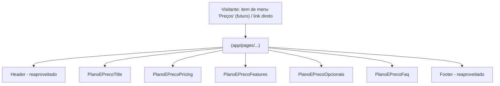

# Plano e Preço Design

**Spec**: `.specs/features/plano-e-preco/spec.md`
**Status**: Draft — aguardando aprovação (Etapa 1)

---

## Architecture Approaches Considered

| # | Approach | Trade-off | Verdict |
| - | -------- | --------- | ------- |
| 1 | **Página estática dedicada** — `app/pages/<rota>.vue` (rota a confirmar) compõe 5 novas sections (`PlanoEPreco*.vue`), cada uma autocontida com conteúdo hardcoded, seguindo exatamente o padrão de `app/pages/eventos.vue`/`app/pages/index.vue` | Nenhum trade-off relevante — é o único padrão de página já existente no projeto | **Recomendado** |
| 2 | Reaproveitar `HeroPricing.vue` (Home) como base, adicionando props/variantes até cobrir todo o conteúdo novo (toggle, tabela comparativa, opcionais, FAQ) | `HeroPricing.vue` cobre só ~20% do conteúdo real do Figma (2 cards simples, sem tabela comparativa, sem opcionais, sem FAQ, sem toggle); forçar esse componente a cobrir tudo violaria a regra do projeto de nunca adaptar o Figma para caber no código existente | Rejected |
| 3 | Tabela comparativa como componente genérico parametrizável por qualquer conjunto de features (reutilizável por outras páginas futuras) | Especulação de reuso futuro sem um segundo consumidor real hoje; o projeto trata isso como abstração prematura (ver regra "não crie uma abstração para um caso único" em `CLAUDE.md`) | Rejected para esta feature — se uma segunda página comparativa aparecer no futuro, promover então |

**Decision**: Approach 1. Cada seção do Figma vira um componente `sections/PlanoEPreco*.vue` prefixado, composto na nova página; camadas `layout/`/`ui/` existentes são reaproveitadas onde a estrutura já bate (ver Code Reuse Analysis).



---

## Code Reuse Analysis

Baseado no relatório do agente de exploração (busca em `layout/`, `sections/`, `ui/` no branch atual): **nenhum componente de toggle segmentado, tabela comparativa ou expandir/recolher existe hoje no projeto** — os três precisam ser construídos novos. Não há colisão de nome para o prefixo `PlanoEPreco` em nenhum componente existente.

### Existing Components to Leverage

| Component | Location | How to Use |
| --- | --- | --- |
| `CtaButton.vue` | `app/components/ui/CtaButton.vue` | Todos os CTAs ("Testar grátis por 30 dias", "+ Opcionais", "Site & hotsite padrão") |
| `Faq.vue` (layout) + padrão `CrmFaq.vue` (sections) | `app/components/layout/Faq.vue`, `app/components/sections/CrmFaq.vue` | Base para `PlanoEPrecoFaq.vue` — único wrapper de FAQ presente neste branch (Eventos/Base de Conhecimento vivem em branches próprias, ainda não mergeadas); mesma estrutura de accordion nativo `<details>/<summary>` |
| `ui/FeatureList.vue` | `app/components/ui/FeatureList.vue` | Candidato de base para a lista de 9 recursos dos cards de preço (Pricing) — mais simples que a tabela comparativa; avaliar na Task se cobre o formato bullet+ícone verde do Figma ou se precisa de props adicionais |
| Ícones já existentes (a confirmar visualmente antes de reusar, ver manifesto) | `public/icons/faq-plus-circle.svg`, `faq-minus-circle.svg`, `icon-check-circle.svg`, `icone-check-verde-circulo.svg`, `icone-check-lista-urbano.svg`, `seta-lista-verde.svg`, `seta-botao-cta.svg`, `icone-seta-cta.svg`, `seta-botao-branca.svg`, `logo-subsee-on.svg`, `crm-hero-divider-onda.svg` (e variantes) | Cada um é candidato de reuso para um ícone/decoração equivalente do Figma — comparação visual pixel-a-pixel é uma task própria antes de qualquer export novo, seguindo o mesmo processo já usado em Eventos para `imgPlay`/`imgPlay1` e o divisor de onda |
| Padrão de gradiente inline por seção (não um wrapper compartilhado) | `app/components/sections/CrmUrbanoLeadsChart.vue:59`, `SiteLoteadorasSglOffer.vue:6-7` | Referência para a forma decorativa de fundo (`imgShape`) atrás da tabela de Features — replicar como classe Tailwind arbitrária inline na própria seção, não criar um wrapper novo |

### Componentes/padrões que NÃO existem e precisam ser construídos

| Necessidade | Por quê é novo |
| --- | --- |
| Toggle segmentado Mensal/Anual | Nenhum componente de segmented-control/toggle existe no projeto hoje (confirmado pelo agente de exploração); `LanguageSwitcher.vue`, apesar do nome, é um diagrama estático sem estados interativos — não serve de base |
| Tabela comparativa de funcionalidades (9 categorias × 2 colunas de check) | Nenhuma tabela comparativa existe no projeto; precisa ser nova, dirigida por um array tipado (categoria → lista de features), seguindo a regra do projeto de separar dados de estrutura visual |
| Botão Ocultar/Ver todas as funcionalidades (expandir/recolher) | Nenhum componente de expand/collapse (fora do accordion de FAQ, que é outro padrão) existe hoje |

### Integration Points

| System | Integration Method |
| --- | --- |
| `HeroPricing.vue` (Home) | Seu CTA "Ver todos os recursos inclusos" já aponta para `to="#"` — forte sinal de que esta nova página é o destino pretendido; **atualizar esse `to` fica fora do escopo desta feature** (ver Out of Scope em `spec.md`), mas fica registrado aqui para uma tarefa futura isolada. |
| `HeaderBar.vue:9` | Item "Preços" aponta hoje para `/#precos` (âncora da Home); **não alterado nesta feature** — decisão de navegação cross-page adiada até a rota da nova página ser confirmada. |
| Figma → content pipeline | Mesmo processo já validado: MCP Figma (`get_metadata`/`get_design_context`/`get_screenshot`) → `FIGMA_CONTENT_MANIFEST_PLANO_E_PRECO.md` (verbatim) → assets comparados/exportados → componentes escritos a partir do manifesto, nunca de memória do design. |

---

## Components

Todos os componentes de seção são Vue 3 `<script setup>` SFCs sem props — conteúdo é um `const` local, no mesmo formato de toda `sections/*.vue` existente.

### `app/pages/<rota>.vue` (rota pendente de confirmação — ver Open Question 1 em `spec.md`)
- **Purpose**: Ponto de entrada da rota; compõe as 5 seções na ordem do Figma e define SEO meta (`useSeoMeta`).
- **Interfaces**: none (page component)
- **Dependencies**: as 5 sections abaixo
- **Reuses**: padrão `useSeoMeta` + `<main>` de `app/pages/index.vue`/`app/pages/eventos.vue`

### `PlanoEPrecoTitle.vue` — node `3220:6091`
- **Purpose**: H1 "Planos & Preços" + descrição de abertura.
- **Location**: `app/components/sections/PlanoEPrecoTitle.vue`
- **Interfaces**: none
- **Dependencies**: none além de UI base

### `PlanoEPrecoPricing.vue` — node `3220:6001`
- **Purpose**: Toggle Mensal/Anual (visual, sem lógica de preço — ver Assumption), selo "12% OFF", e os 2 cards de preço (Urbano/Rural) com lista de 9 recursos e 2 CTAs cada.
- **Location**: `app/components/sections/PlanoEPrecoPricing.vue`
- **Interfaces**: none
- **Dependencies**: `CtaButton`, `FeatureList` (a confirmar na Task se cobre o formato), novo sub-componente de toggle (local, sem estado — apenas visual)
- **Reuses**: `HeroPricing.vue` como referência estrutural parcial (2 cards de preço lado a lado) — não como base de código a herdar, dado que a lista de conteúdo, o toggle e os CTAs adicionais ("+ Opcionais") não existem em `HeroPricing.vue`

### `PlanoEPrecoFeatures.vue` — node `3220:6094`
- **Purpose**: Tabela comparativa de 9 categorias de funcionalidades (todas marcadas como incluídas em ambos os planos, conforme manifesto) + botão funcional Ocultar/Ver todas.
- **Location**: `app/components/sections/PlanoEPrecoFeatures.vue`
- **Interfaces**: none
- **Dependencies**: novo ícone de checkmark (a confirmar reuso), estado local `ref<boolean>` para expandir/recolher
- **Reuses**: nenhum componente existente cobre esta estrutura — construído novo, dirigido por um array tipado (ver Data Models)

### `PlanoEPrecoOpcionais.vue` — node `3220:6334`
- **Purpose**: Tabela de 3 complementos pagos (preços idênticos Urbano/Rural) + CTA.
- **Location**: `app/components/sections/PlanoEPrecoOpcionais.vue`
- **Interfaces**: none
- **Dependencies**: `CtaButton`
- **Reuses**: nenhum componente existente cobre esta estrutura de tabela pequena — construído novo

### `PlanoEPrecoFaq.vue` — node `3220:6358`
- **Purpose**: Accordion de 6 perguntas/respostas.
- **Location**: `app/components/sections/PlanoEPrecoFaq.vue`
- **Interfaces**: none
- **Dependencies**: none além de UI base
- **Reuses**: `CrmFaq.vue` (estrutura + `<details>/<summary>` + estilo escopado) como template de clonagem — único wrapper de FAQ presente neste branch

---

## Data Models (formas de conteúdo local, não persistidas)

```typescript
// PlanoEPrecoPricing.vue — card de preço
interface PricingFeatureItem {
  text: string       // suporta bold parcial via segments, como em HeroPricing.vue's FeatureSegment[]
  footnoteMarker?: '*' | '**'
}

interface PricingPlan {
  nome: string              // "Urbano" | "Rural"
  descricao: string
  preco: string             // "R$450/mês + opcionais" — idêntico nos dois planos hoje
  features: PricingFeatureItem[]  // 9 itens, conteúdo idêntico nos dois planos hoje
}

// PlanoEPrecoFeatures.vue — tabela comparativa
interface FeatureRow {
  label: string
  incluidoUrbano: boolean   // true em 100% das linhas extraídas hoje
  incluidoRural: boolean    // true em 100% das linhas extraídas hoje
}

interface FeatureCategory {
  titulo: string
  itens: FeatureRow[]
}

// PlanoEPrecoOpcionais.vue — tabela de complementos
interface OpcionalRow {
  label: string
  precoUrbano: string
  precoRural: string
}

// PlanoEPrecoFaq.vue — mirrors CrmFaq.vue's inline `faqs` shape
interface FaqItem {
  question: string
  answer: string
}
```

**Relationships**: nenhum — cada array é local ao seu próprio componente, sem estado cruzado ou persistido. Os campos `incluidoUrbano`/`incluidoRural` em `FeatureRow` são mantidos como booleanos independentes (não um único `incluido: boolean` compartilhado) para não esconder, na modelagem de dados, o fato de que o Figma *poderia* diferenciar as colunas — mesmo que hoje, em 100% das linhas extraídas, ambos sejam sempre `true`.

---

## Error Handling Strategy

| Error Scenario | Handling | User Impact |
| --- | --- | --- |
| Imagem/ícone falha ao carregar | Nenhum tratamento além do `alt` padrão — mesmo padrão de toda seção existente no site | Ícone quebrado no navegador; coberto pela auditoria de QA, não por código |
| `href` placeholder (`#`) dos CTAs sem destino real | Nenhum tratamento especial — comportamento idêntico ao já aceito em `HeroPricing.vue` | Clique não navega para lugar nenhum até o destino real ser confirmado (Open Question) |

---

## Risks & Concerns

| Concern | Location (file:line) | Impact | Mitigation |
| --- | --- | --- | --- |
| Rota da página ainda não confirmada pelo usuário | `spec.md` Open Question 1 | Bloqueia a criação de `app/pages/<rota>.vue` na Etapa 3 | Resolver antes de iniciar Tasks/Execute; usar `/planos-e-precos` como proposta provisória apenas para fins de design, não de implementação |
| Nota do marcador `**` não localizada em nenhum node do Figma | `FIGMA_CONTENT_MANIFEST_PLANO_E_PRECO.md` §2.4 | Risco de inventar conteúdo se não tratado explicitamente | Item de lista renderiza sem footnote associada até o texto ser fornecido (Assumption já registrada) |
| Toggle Mensal/Anual tem apenas 1 estado desenhado no Figma | `FIGMA_CONTENT_MANIFEST_PLANO_E_PRECO.md` §2.1 | Implementar como funcional exigiria inventar o valor do preço anual | Implementar como visual estático fiel ao Figma, sem lógica de troca de preço (Assumption já registrada) |
| Assets de ícone precisam de comparação visual antes de reuso (checkmark, seta, logo, divisor de onda) | ver tabela "Assets a exportar/confirmar" no manifesto | Reusar um asset visualmente diferente do Figma quebraria a fidelidade visual | Task dedicada de comparação visual antes de qualquer export novo — mesmo processo já usado em Eventos para `crm-hero-divider-onda.svg` e `imgPlay`/`imgPlay1` |
| Nenhum componente de toggle segmentado ou tabela comparativa existe hoje no projeto | n/a | Não há template de código a copiar; maior superfície de decisão de implementação | Construir como componentes novos, dirigidos por array tipado, seguindo a regra do projeto de separar dados de estrutura visual |

> Todos os concerns identificados têm mitigação acima; nenhum bloqueia a aprovação desta Etapa 1 — bloqueiam apenas o início da Etapa 3 (Execute), condicionados às Open Questions do `spec.md`.

---

## Tech Decisions (feature-local only)

| Decision | Choice | Rationale |
| --- | --- | --- |
| Toggle Ocultar/Ver todas as funcionalidades | `ref<boolean>` local em `PlanoEPrecoFeatures.vue`, sem estado compartilhado com outras seções | Os 2 estados existem desenhados no Figma (`Button Ocultar` visível / `Button Descoultar` oculto) — comportamento simples de mostrar/ocultar, sem necessidade de estado global |
| Toggle Mensal/Anual | Renderizado como visual estático (estado "Mensal" sempre ativo), sem `v-model`/estado | Nenhum segundo estado nem preço anual existe no Figma; ver Risks acima |
| Centralização de elementos absolutos (ex.: texto dentro do badge "12% OFF", ícone dentro do CTA) | Flexbox (`items-center justify-center`), nunca `-translate-x-1/2 -translate-y-1/2` | `AD-007` (bug sitewide confirmado): nenhuma classe `translate-x-*`/`translate-y-*` gera CSS neste site; o código de referência gerado pelo Figma MCP usa esse padrão literalmente e não deve ser copiado verbatim |
| Ícones decorativos compostos (selo "12% OFF") | Exportar como uma única imagem achatada, não recriar como múltiplos elementos posicionados | Composição de 5 vetores + texto rotacionado é puramente ilustrativa; recriar fielmente em HTML/CSS seria desproporcional ao valor (mesmo critério já usado para mockups de dashboard em outras páginas) |

---

## Requirement Traceability (Design pass)

Todos os 11 `PEP-NN` do `spec.md` mapeiam para os 5 componentes de seção acima + 1 página. Nenhum requirement foi descartado ou reinterpretado. Status permanece `Pending` até a Etapa de Tasks formalizar o mapeamento `PEP-NN → T-NN`.
